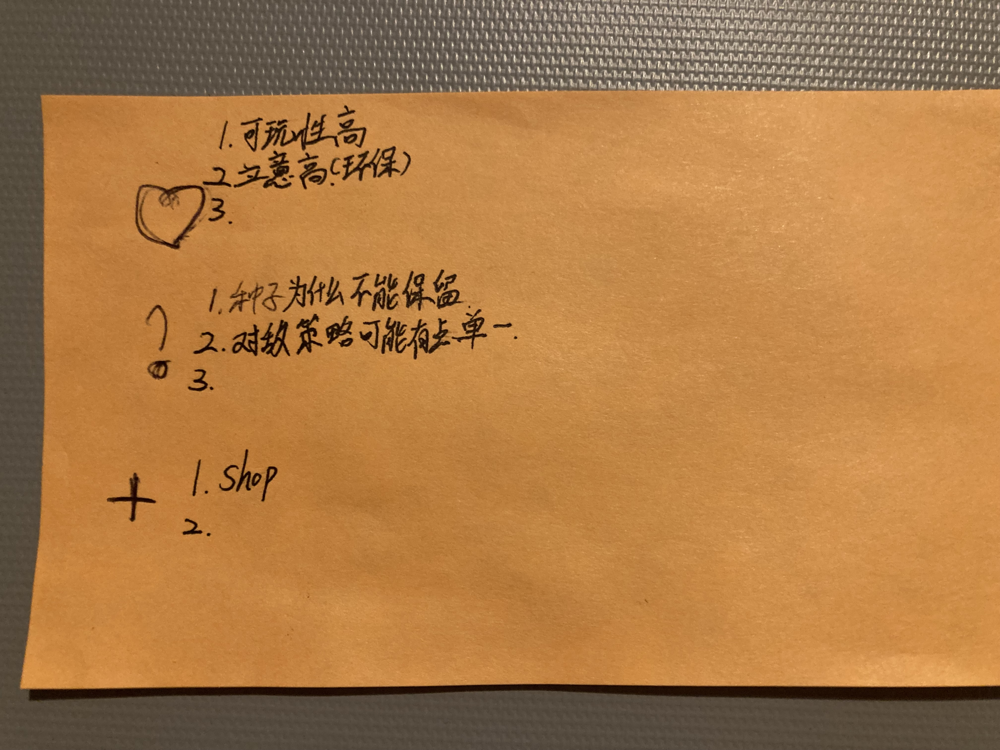

# Meeting Record February 6, 2025

This discussion primarily focused on analyzing current **user feedback**, finalizing the **visualization of all pre-level-1 game scenes** (addressing any remaining ambiguities), and prioritizing **artistic and narrative styles**.

## **User Feedback Analysis**

1. **Balance of Skill Combinations**
    
    Some users raised concerns regarding the **balance of combined skills**, specifically whether certain skill combinations could be overly powerful, leading to a lack of gameplay diversity.**⇒ Decision:** This issue will be tested and adjusted in the **game parameter tuning** phase to prevent imbalance.
    
2. **Issues with the Resource System**
    
    Users questioned why **seeds do not carry over between levels**, while **plants do**, which seems inconsistent.
    
    **Current Design:**
    
    - **Seed Acquisition Sources:** Seeds are obtained through **predefined level allocations** and **completion rewards**.
    - **Fixed Seed Allocation:** Each level starts with a **fixed number of seeds**, but exceptional performance (e.g., achieving a high restoration rate of degraded land) increases the **rewarded seed quantity**, which can then be carried over to the next level.
    - **Transplanting Mechanic:**
        1. Transplanting reflects the game’s **continuity**, meaning that players performing well in one level can **store and replant** previously cultivated plants in future levels.
        2. The incentive for **transplanting over germination** is that **transplanted plants are more efficient** than newly germinated ones.
        3. The **transferable plant ratio** will be fine-tuned during **parameter adjustments** in later development.
3. **What Happens if Resources Accumulate Excessively? What Is the Game’s Ultimate Goal?**
    - As a **single-player game**, the **completion of the narrative progression** marks the end of the game.
    - Alternative **side endings** may be considered in future expansions, but this will be discussed **after the MVP is completed**.
    - Having **excessive resources in one level** does not guarantee a **smooth transition to the next level**, but it **may provide an advantage**.
        - For instance, players cannot predict whether the next stage will feature plants that are better suited to the new environment. This aspect also involves **game parameter balancing** and can be controlled by **limiting the number of game element updates per level** to regulate inter-level influence
        - This aspect will also be fine-tuned in the **game parameter balancing phase**.
4. **Gameplay Depth vs. Complexity**
    
    Users found mechanics like **“skill combinations” and “ecosystem interactions”** engaging but potentially **too complex for some players** due to the learning curve.**⇒ Solution:** Introduce a **simple and fundamental** strategy option where players can progress using a straightforward **resource accumulation** approach **without** extensive skill combinations.
    

## **Worldbuilding and Art Design**

1. **Art Style**
    - **Pixel art** will be used for **object creation**, while the **scene design** will follow a **post-apocalyptic aesthetic**.
2. **Narrative & Real-World Integration**
    - The worldbuilding will incorporate **real-world elements** to encourage **broader player engagement and thought expansion**.
3. **Next Discussion Focus**
    - Evaluate **2–3 possible object and scene design combinations** based on **feasibility and implementation complexity** in development.

## **Paper Prototype Video**

A full **pre-level-1 scene demonstration** will be created, covering:

- **Game login → Map selection → First level initiation**
- Player interactions, tutorial, gameplay mechanics, and object combinations.

## **Updated Game Rules and Scene Adjustments**

## **Minimum Viable Product (MVP) Scope**

The **current MVP goal** is to **fully implement all game scenes** from **game login to the completion of Level 1**.

### (中文)

本次討論主要解析目前獲得的用戶回饋，**將第一關之前的場景的所有具體化呈現**（若尚存有模糊的部分，再行補充），以及美術與敘事風格的排序。

1. 用戶反饋：
    1. 組合技能的平衡性：有用戶反應技能組合是否會影像遊戲平衡，即組合技能過於強大導致遊戲玩法單一化
        
        ⇒ 經討論後，決定在後期**遊戲參數調整**上進行測試，避免次狀況
        
    2. 資源系統的問題：為什麼上一關的地圖中，種子無法保留至下一關，但植物可以？難免有些不合理
        
        ⇒ 目前遊戲中，種子的獲取來源為：關卡預設、通關獎勵。每一關初始預設的種子數量為固定的，但若通關表現良好，如：失地復綠比例極高，則在該關結算獎勵時，會進一步提高獎勵種子數量，這部分的獎勵是可以帶入下一關卡進行種植的
        
        ⇒ 移植的概念，是遊戲中「連續性」的展現，即上一關卡通關表現良好時，玩家可以透過移植的方法，將上一關的植物存儲至資源欄，之後進行使用，使用的誘因是，「移植」比「發芽」要有效率，若無法移植，每次遊戲開始時，皆需要從「零」開始發展。（可移植比例代後期遊戲參數調試決定）
        
    3. 若積累的資源特別多，會出現什麼情況？遊戲的結束後的最終目的是？
        
        ⇒ 首先，這是一個單機遊戲，因此當遊戲敘事進度完結後，即完成遊戲。（可以考慮安排其他方式的支線結局進行拓展，但待最小可行性產品完成之後再進行討論）
        
        ⇒ 若某一關卡，資源累積特別多，並不代表下一關會特別通順，但可能會有優勢，如：玩家無法預測下一階段的關卡是否存在更具適性的植物。（這部分也涉及遊戲參數調試，也可透過限制每一關的遊戲元素更新數量來控制關卡之間的互相影響）
        
    4. 玩法多元但複雜：「組合技」和「生態系」等玩法有助於提高可玩性，但對於部分玩家而言，學習成本可能略高
        
        ⇒ 這部分，可以透過設計一種「簡單且基本」的玩法解決，即有一種遊戲策略無需考慮過多的搭配組合，只需要單存進行資源累積即可完成
        
2. 世界觀故事、美術設計：
    1. 以「像素風」進行物件建立，以「廢土風」進行場景設計
    2. 世界觀中，可以納入一些現實元素，拓展玩家思維
    3. 下次討論，2、3種「場景以及物件」設計的組合，在分析開法中實際上能夠實現的完成度
3. Paper prototype影片：實現遊戲中第一關之前的所有場景，如：遊戲登入⇒選地圖⇒選地圖⇒第一關遊戲，具體涉及玩家互動、新手教程、遊戲玩法、物間之間的組合
4. 新版遊戲規則、場景更新
5. 目前最小可行性產品的範圍為：實現從遊戲登入至第一關結束間的所有場景

---

## Meeting Agenda for Next Meeting (Update on February 2, 2025)

- **Video Recording of the Paper Prototype**
- **Minimum Viable Gameplay (MVG), Scenario Construction, and Defining the Minimum Viable Product (MVP)**
    - **Use Case Diagram Analysis of Gameplay**
        - What are the player actions? What are the victory conditions (restoration of degraded land) and failure conditions?
    - **Reward Mechanism Design**
        - Utilizing **eco-points** to restore land, unlock new plants and cards?
        - Balancing card-based mechanics and resource management?
    - **Detailed Implementation of the Resource and Adventure Systems**
        - Should there be **technology points, eco-points, or a tech-tree system**?
        - How should **natural disasters be anthropomorphized**? A list of enemy types and behavior patterns.
    - **Detailed Design of Game Areas and Scenes**
    - **Interaction Design for Game Characters**
        - How to enable player interaction **without an in-game avatar**?
- **Software Development**
    - **Discussion of Current Implementations and Required Game Design Components**
    - **Detailed Task Breakdown**
    - **Establishing a Development Log**
- **Further Refinement of the Game’s Worldbuilding**
    - **Application of the Ink-Wash Art Style**
        - Should all elements adopt the ink-wash aesthetic?
        - Can a sample scene be designed as a prototype?
    - **User Experience (UX) and User Interface (UI) Design**
- **Tracking the Plant Attribute Database**
- **Discussion on the Rotation System for the Project Manager (PM)**

### (中文)

1. Paper Prototype的影片拍攝
2. 遊戲的**最小可行玩法**，構建實現場景，以及確定遊戲的最小產品實現
    - Use Case Diagram 分析遊戲玩法
        - 遊戲主角行為？遊戲的勝利條件（失地復綠）與失敗條件？
    - 獎勵機制的設計：
        - 使用生态点数修复土地，解锁新的植物和卡牌？
        - 卡牌與資源管理的平衡性？
    - 資源、冒險系統的更具體實現
        - 科技點？生態點？科技樹系統？
        - 災害如何擬人化的具體實現？敵方類型與行為模式列表
3. 軟體開發：
    - 討論目前已實現測試，以及需要的遊戲設計內容？
    - 任務的具體拆分
    - 開發日誌建立
4. 世界觀的進一步具體化
    - 水墨風格的具體應應用？是否所有元素都使用水墨風格？能否先設計一個場景？
    - 使用者體驗（前端介面頁面）設計（UI）
5. 植物屬性資料庫追蹤
6. 討論PM輪值制度

---

# Meeting Record January 30, 2025

- Evaluate the two groups' paper prototypes, identify similarities and differences, and determine which design elements should be integrated.
- **Discuss the game's world building, narrative themes, and art style.**
- **Initial planning of the technical requirements for digital development and potential technical challenges.**

## **Discussion Summary:**

The purpose of this discussion was to integrate the two game subplot concepts proposed in the last meeting (meeting records 2025/1/28). The Minimum Viable Product (MVP) will feature a **turn-based strategy** game that centers around plant cultivation and wasteland restoration as its core mechanics.

1. The game is divided into a “Cultivation System” and a “Combat System,” interconnected through a “Reward Mechanism.”
    - The integration between the cultivation and reward systems, as well as the combat and reward systems, will be simulated and refined during the later stages of development.
    - The game will adopt a top-down perspective, eliminating the need for an in-game player avatar.
    1. **Cultivation System:** Serves as the resource accumulation process, focused on restoring degraded lands (referred to as “green zones”). Resources accumulate each turn, forming the foundation for restoring subsequent areas.
        - Each type of plant corresponds to a specific type of degraded land, necessitating the creation of a detailed plant database.
    2. **Combat System:** Acts as the primary resource expenditure mechanism, with natural disasters as the adversaries.
        - Implemented as a turn-based strategy, focusing on defending against natural disasters; enemies are anthropomorphized as disaster-themed creatures.
2. The game’s success condition is defined by the complete restoration of all degraded areas within the world.
3. **Software Development:**
    - The development process will be divided into tasks, which will be reviewed and confirmed in subsequent task overview sessions.
4. **Control Mechanics:**
    - Primary interactions via mouse, with keyboard as auxiliary input.
5. **Art Style:** Inspired by “Ink Wash Painting” (referencing *The Scroll of Rivers and Mountains*).
6. **Worldbuilding:** Incorporates themes of natural disasters, land restoration, and the principles of elemental interaction.
7. **Paper Prototype Development:** Once the specific in-game units are finalized, the paper prototype can be initiated.

### (中文)

本次討論為確定上次討論提出（meeting records 2025/1/28）的提出的兩個遊戲支線概念進行整合，目前最小可行性產品確定以**戰棋式回合制**遊戲來實現植物種植與失地復原的遊戲主軸。

1. 遊戲切割為“種植系統”與“戰鬥系統”，這兩個系統，透過“獎勵機制”來實現兩個系統的串聯
    - 種植系統與獎勵系統的串聯、戰鬥系統與獎勵系統的串聯，等待由後期的調適進行模擬整合
    - 直接以上帝視角進行遊戲，無需創建遊戲中玩家的投影
    1. 種植系統扮演：資源累積的過程，已經確定修復的失地（以「綠地」代稱），每個回後能夠累積資源，成為推動下一個區域修復的資源基礎
        - 每種植物對應著適合的失地屬性 ⇒ 需要建立相關的植物具體細節資料庫
    2. 戰鬥系統：作為資源消耗的主要原因，敵方為天然災害
        - 以戰棋回合制實現，主要在抵禦天然災害 ⇒ 敵方這個概念，以災害擬怪化實現
2. 遊戲的最終成功條件判定為，將世界中所有區域的失地進行修復
3. 軟體開發：
    - 將開發軟體開發過程進行任務切割 ⇒ 待進行任務瀏覽確認後
4. 具體操作細節：
    - 由滑鼠進行主要操作，鍵盤為輔助操作
5. 美術風格：《江南百景圖》，水墨風格
6. 世界觀：包含自然災害、失地修復、以及屬性相剋原理
7. 紙上原型（Paper Prototype）製作：待遊戲中具體（植物及災害間的關係）單位確認後，即可開始著手進行紙上原型製作

---

## Meeting Agenda for Next Week (Update on January 29, 2025)

Currently, the team is divided into two groups, each working independently on a Paper Prototype based on the same fundamental game concept.

- Evaluate the two groups' paper prototypes, identify similarities and differences, and determine which design elements should be integrated.
    - What are the key findings from the prototype testing?
    - Does the current gameplay design align with the expectations of strategy-oriented players?
    - Are there any mechanics or design aspects from both prototypes that should be retained or modified?
    - Is further testing required, or can we proceed directly to digital prototype development?
- **Discuss the game's world building, narrative themes, and art style.**
- **Initial planning of the technical requirements for digital development and potential technical challenges.**

### (中文)

- 目前分為兩組分別進行 Paper Prototype，在同一個遊戲基本概念的基礎上，獨立進行開發，待下次討論後將兩組的結果結果進行分析討論，進一步整合。
- 針對兩組的紙上原型進行評估，找出異同點，並確定哪些設計要素應該被整合。
    - 兩組原型測試的主要發現是什麼？
    - 目前的玩法設計是否符合策略型玩家的預期？
    - 兩組原型中是否有機制或設計值得保留或修改？
    - 是否需要進一步測試，或可直接進入數位原型開發？
- **討論遊戲的世界觀、敘事主題、整體美術風格。**
- **初步規劃數位開發的技術需求、以及可能遇到的技術困難。**

---

# **Meeting Record January 28, 2025**

## Meeting Agenda

1. Decide the priority of execution between **Idea 1** and **Idea 2**.
2. Discuss the design style of the games and determine the target player demographics for each concept.
3. Define and concretize the two-game concepts into detailed projects, including discussions on their respective prototypes (Minimum Viable Product).
4. Identify potential technical or design challenges associated with both game concepts. (To be examined in detail after the completion of the Paper Prototype.)

## **Discussion Summary**

**1. Game Design Style and Target Audience**

- The team discussed how to integrate the existing two game concepts, focusing on deciding which concept to prioritize for development, identifying the target audience, defining the game style, and determining the core gameplay mechanics.
- The discussion emphasized defining the **Minimum Viable Product (MVP)** through a **paper prototype**, helping to validate the feasibility of the game development process.
- The worldview, narrative themes, and art style will be collaboratively edited online using [Google Doc](https://docs.google.com/document/d/1UdnjfAfNBcTixd8yQA9BvX43T0jND-WYGh5WYngCCVc/edit?usp=sharing). Team members are encouraged to integrate elements of interest into the document, which will be reviewed and discussed in the next meeting.
- **Key Decisions:**
    1. **Core Gameplay Mechanics:**
        - Tower defense
        - Light strategy simulation
        - Resource accumulation and consumption
        - Collectible compendium system
    2. **Target Audience:**
        - Art style aimed at **teen players (12+)**
        - Primary focus on **strategy-oriented players**
    3. **Platform:**
        - PC
    4. **Narrative Theme:**
        - Possible themes such as **environmental conservation and endangered species**
    5. **Art Style Reference:**
        - Inspiration from **Mole Manor**
1. **Priority Execution Order**
    - The decision on which game concept to prioritize was made based on:
        1. **Technical Feasibility:** Evaluating which core mechanics are easier to implement within the team's current capabilities.
        2. **Player Appeal:** Determining which concept aligns better with the identified target audience.
2. **Prototype Development Plan**
    - **Objective:** Create a **paper prototype** to confirm feasibility before proceeding with digital implementation.
    - Dividing the team into two groups, each working independently on a Paper Prototype based on the same fundamental game concept. After the next discussion, the results from both groups will be analyzed and reviewed for further integration.
    - Define gameplay loops and mechanics.
    - Develop an initial **flowchart or storyboard** for key game interactions.
    - Prepare an early-stage prototype for testing and validation.

### **（中文）**

1. **遊戲設計風格與目標玩家**
    - 本次討論如何整合現有的兩個遊戲概念，重點關注 **確定優先開發的順序**、**目標玩家**、**遊戲風格** 以及 **核心玩法**。
    - 討論過程強調透過 **紙上原型（Paper Prototype）** 確認遊戲概念的可行性，進一步回推所需的開發工作。
    - 世界觀與敘事主題、美術風格，之後以[Google Doc](https://docs.google.com/document/d/1UdnjfAfNBcTixd8yQA9BvX43T0jND-WYGh5WYngCCVc/edit?usp=sharing)進行線上協同編輯，鼓勵各位將有興趣的元素整合到線上，並在下此討論中進行研討。
    - **關鍵決策：**
        1. **核心玩法：**
            - 塔防機制
            - 輕度策略模擬
            - 資源累積與消耗
            - 收集圖鑑系統
        2. **目標玩家：**
            - 風格偏向 **青少年（12+）**
            - 主要針對 **策略型玩家**
        3. **實現平台：**
            - PC
        4. **世界觀與敘事主題：（**待討論）
            - 可能的主題，如 **環保、瀕危物種**
        5. **美術風格參考：（**待討論）
2. **確定概念優先執行順序**
    - 根據以下兩個因素決定遊戲概念的優先開發順序：
        1. **技術可行性：** 評估核心玩法在團隊現有技術能力下的可實現性。
        2. **玩家吸引力：** 確認哪個遊戲概念與目標玩家群體的需求更為匹配。
3. **紙上原型開發**
    - **目標：** 透過 **紙上原型（Paper Prototype）** 來確認遊戲的可行性，確保核心機制運作順暢後再進入數位化開發階段。
    - 目前分為兩組分別進行 Paper Prototype，在同一個遊戲基本概念的基礎上，獨立進行開發，待下次討論後將兩組的結果進行分析討論，進一步整合。
    - 確定遊戲的基本玩法循環（Gameplay Loop）。
    - 設計主要互動流程的 **流程圖（Flowchart）** 或 **故事板（Storyboard）**。
    - 準備初步的紙上原型進行測試與驗證。

---

## Meeting Agenda for Next Week (Update on January 27, 2025)

Currently, there are two proposed game concepts:

1. **Mole Manor (Simulation Game)**: A management simulation game that combines multiple mini-games with mechanics such as **combat, resource accumulation, and resource consumption** through scene switching.
2. **Tower Defense + Survival (Story-based Game)**: Inspired by *Plants vs. Zombies* with elements from a fantasy creature collection world and a collectible compendium.

### Agenda:

1. Discuss the design style of the games and determine the target player demographics for each concept.
2. Decide the priority of execution between **Idea 1** and **Idea 2**.
3. Identify potential technical or design challenges associated with both game concepts.
4. Define and concretize the two-game concepts into detailed projects, including discussions on their respective prototypes (Minimum Viable Product).

### (中文)

1. **討論遊戲設計風格及玩家定位：**
    1. 確定兩個遊戲概念的核心設計風格（例如：畫風、世界觀）
    2. 目標玩家群體：年齡層、遊戲習慣（休閒玩家 vs 策略玩家）、平台（手機 vs PC）
2. **確定概念優先執行順序：**技術可行性、玩家吸引力
3. 確定兩個遊戲概念可能出現的具體問題
4. 確定兩個概念的最小可行性產品（Prototype）的範圍，並分配相關責任。

---

# Meeting Record January 23, 2025

## **Meeting Agenda**

1. Discuss and finalize game ideas for the project.
2. Define the tone and core gameplay mechanics for game development.
3. Explore feasible implementation methods based on current resources.

## Discussion Summary

1. **Introduction of Game Ideas**:
    - Two potential game ideas were proposed and discussed during the meeting.
    - A team member demonstrated their prior experience in developing a simple game called "[Crow Hitting](https://redial17.github.io/jspractice/)," following this [tutorial](https://www.youtube.com/watch?v=GFO_txvwK_c).
        - This example served as a concrete reference for understanding the game development process.
2. **Inspiration from Stardew Valley**:
    - Building upon ideas discussed in the previous meeting (January 14, 2025), the team explored implementing concepts inspired by *Stardew Valley*.
    - **Implementation Suggestion**: Focus on recreating specific scenes or mechanics instead of the entire game.
        - Given the capabilities of **p5.js**, dynamic backgrounds and scene transitions could be implemented using techniques such as scene switching or moving background images.
3. **Proposed Game Ideas**:
    - **Game Idea 1: Mole Manor (Simulation Game)**
        - **Concept**: A simulation game combining multiple mini-games, such as resource gathering, combat, and management, with the goal of upgrading a farm estate to Level 10.
        - **Core Gameplay**:
            - Players can pursue three branching paths:
                1. **Haunted House**: Catch ghosts in a cemetery using special tools and solve puzzles to capture powerful ghosts. (Risk: Debuffs from curses.)
                2. **Tourism**: Build a cozy estate for visitors.
                3. **Farming**: Plant crops, sell produce, and purchase materials to repair and upgrade the estate. (Risk: Debuffs from exhaustion.)
            - **Endgame Conditions**:
                - Bankruptcy, illness, or being caught by a ghost.
    - **Game Idea 2: Tower Defense + Survival (Story Game)**
        - **Concept**: A hybrid game inspired by *Plants vs. Zombies* and a fantastical creature collection theme.
        - **Core Gameplay**:
            - Incorporates tower defense mechanics with survival elements and features a collectible creature or resource guidebook.

---

# Meeting Record January 21, 2025

## **Meeting Agenda**

1. Determine the direction of the project and narrow down game types.
2. Discuss potential challenges for different game types.
3. Plan next steps.

## Discussion Summary

1. **Game Type Selection**:
    - The team decided to narrow the project scope to **three game types**:
        1. Construction Simulation
        2. Narrative
        3. Puzzle
2. **Discussion on Innovation vs. Remake**:
    - The idea of choosing between a remake or an innovative approach was brought up.
    - **Decision**: This discussion will be postponed for now.
3. **Challenges for Each Game Type**:
    - **Construction Simulation**:
        - Potential difficulty: Heavy backend computations required for implementation may be unrealistic with current resources.
    - **Narrative (or Puzzle)**:
        - Key challenge: Writing and planning the storyboarding and scripting.
        - It was noted that this type would require team members with relevant experience or strong interest to lead this effort.
4. **Next Steps**:
    - Before the next discussion, all participants are to **review the project results** of other teams from the past two years (2023 & 2024).
    - Analyze those projects to identify **feasible outcomes** for reference.

---

# Meeting Record January 16, 2025

### Discussion Summary

This meeting focused on assigning team members to select their preferred game options (based on the options listed in the presentation) for research. Each member is tasked with compiling their research findings and personal reflections into a **report**. These reports will serve as the basis for deciding the theme, game type, and game elements for development.

**Deadline:** Please upload your report to **Github** by Sunday.

### Development Strategy

The current idea is to build upon the mechanics of existing games, and then add new elements and features. This approach aims to streamline the development process and avoid unnecessary complexity.

Additionally, all members are encouraged to explore the limitations of using **p5.js** for game development. It is recommended to visit [**p5play**](https://p5play.org/play/) to review examples of games developed with p5.js and gain inspiration from others' projects.

---

# Meeting Record January 14, 2025

The discussion's primary focus was on team members' past gaming experiences and the game elements they hope to incorporate. The proposed elements are as follows:

1. Developing the game with an RPG framework as the core.
2. Reference games include:
    - **Pokemon** (monster mechanics),
    - **Rusty Lake** (puzzle-solving and escape room elements),
    - **Stardew Valley** (farming, market economy, and more complex economic models).
3. Additional elements under consideration:
    - Chinese-style horror,
    - Romance.

The **prototype** is expected to be presented during the midterm evaluation, which is scheduled for one month from now. The current approach uses **Stardew Valley** as the foundational layer, with plans to gradually integrate other elements later.

Currently, the primary focus is on game programming, particularly learning **`p5.js`**, implementing in-game interactions, and managing function calls between different modules. Additional features, such as battles, romance, and puzzles, will be refined and integrated during the storyline development phase.

---
