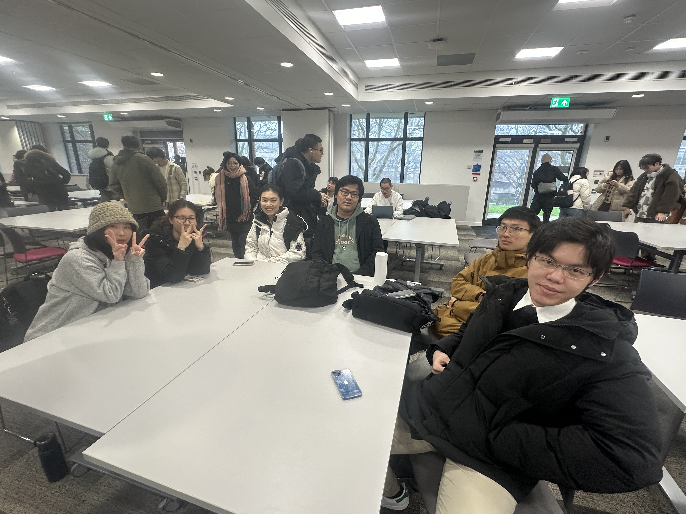

# 2025-group-12

[Kaban](https://succulent-fedora-3cf.notion.site/18c028ddf64e809da9e4f3fcc03ee99d?v=18c028ddf64e80aaa882000ce3420299)

## Your Game

Link to your game [PLAY HERE](https://uob-comsm0166.github.io/2025-group-12/)

Your game lives in the [/docs](/docs) folder, and is published using Github pages to the link above.

Include a demo video of your game here (you don't have to wait until the end, you can insert a work in progress video)

## Your Group

Add a group photo here!

Chin Wei Liu, rq24239@bristol.ac.uk, Chin-pro, manager

Xiaoyu Wu, ni24070@bristol.ac.uk, wendywuxiaoyu

Fan Meng, xa24801@bristol.ac.uk, p1umage

Xiaobai Zheng, iu24160@bristol.ac.uk, wheeinside

Rui Zhang, xs24368@bristol.ac.uk, redial17

Zhenghao Yang, kj24716@bristol.ac.uk, saquantum

## Project Report

### Introduction

The Green Renaissance is a turn-based tactics chessboard game, emphasising the flexibility and diversity of gameplay strategies, as well as the intricacies of resource management. The elements of the game are introduced progressively, making it easy to comprehend and learn while escalating challenges as the game progresses, reflecting the interconnected nature of these elements. Thus, players are encouraged to create a thoughtful strategy that will help them succeed in the game. 

The background story of our game invites you to explore a world being rebuilt after the devastation caused by natural disasters. Various plants, which develop from seeds after several turns of being cultivated, are employed as our chess soldiers in the struggle against disasters. Although these plants cannot move after cultivation, they can acquire different skills and enhance their ability when cultivated in close proximity, forming an ecosystem. After each game stage, all surviving plants are moved to the player's inventory for use in later stages. It would be challenging if a player consumes too many or grows too few resources, requiring players to think carefully before making their moves.

We are not looking for a conventional Mario-genre 2D side-scrolling platform game, but rather something innovative. Our initial game idea is inspired by a similar tactics game, <em>Into the Breach</em>, where players control a group of mecha warriors on a grid battlefield, and a tower defence game, <em>Carrot Fantasy</em>, where players cultivate plants that fire ballistae, similar to <em>Plants vs. Zombies</em>. Both games focus on planning and strategy. Evolved from these games, our game stands out for its uniqueness (as far as our knowledge) in gameplay and mechanics, making it enchanting to players .

### Requirements 

- 15% ~750 words
- Use case diagrams, user stories. Early stages design. Ideation process. How did you decide as a team what to develop?

  

  

### Design

- 15% ~750 words 
- System architecture. Class diagrams, behavioural diagrams. 

### Implementation

- 15% ~750 words

- Describe implementation of your game, in particular highlighting the three areas of challenge in developing your game.

Epic:
  Provide challenge to whom is interested in strategy games

stories & criteria:
  1. As a new player, I want to change difficulty of the game so that I can understand the game quickly.
     Given I have no previous strategy game experience, when I play the starting several stages, then I can get use to the gameplay.
  2. As a hard-core player, I want the game to be joyful and challengable so that I can enjoy the game.
     Given I have cleared the story mode of the game and fully enjoyed, when I want some extra challenge, then the game provides an infinite mode and other game modes.
  3. As a freshman in an art-related major, I want to understand how artistic concepts are projected into games so that I can expand the possibilities and scope of my artistic applications.
  4. As an aesthetically conscious individual without an art background, I want to gain insights into specific art-related knowledge through gameplay experiences so that I can construct my own perspective on artistic systems.
  5. As an art educator (advocate), I want to introduce the composition of various artistic style elements through multiple platforms so that my audience can concretely understand the practical applications of art.

  6. As a natural plant lover, and I want to have a plant-centered game that provides in-depth and rich plant knowledge, as well as some of the actual plant functions. So I hope the game has a complete and detailed illustration function.
     Given a extra plant illustrations, when players click each picture, 
     then it will shows the plant prototype, family, genus, species, suitable planting environment, growth cycle, medicinal value, economic value.
  7. As an environmental enthusiast, I want the game to simulate real-life planting experiences with diverse environments and climate systems, so that I can experience the challenges and excitement of randomness in plant cultivation.
     Given a randomized weather system integrated into the game, when a tactical board game starts and a weather condition is randomly selected (e.g., sunny, rainy, windy, drought, frost), 
     then the selected weather should provide corresponding buffs or debuffs that directly affect the growth attributes of plants in the current game session (e.g., growth speed, health, resilience, or yield).  

### Evaluation

- 15% ~750 words

- One qualitative evaluation (your choice) 

  The heuristic evaluation of the game project identified several critical issues affecting usability, gameplay intuitiveness, and strategic clarity. The most severe issues (Severity ≥ 3.67) include **unclear core mechanics**, where players struggle to grasp fundamental gameplay concepts, requiring improved tutorials and visual guidance. Additionally, **the stamina bar only becomes visible in the second level’s second round**, which can disrupt strategic planning; this should be addressed by introducing it earlier. Another major concern is **unclear disaster and enemy movement logic**, which hinders strategic decision-making and could be resolved through better visual indicators. Furthermore, **resource values lack explicit meaning (Magic Number issue)**, requiring clearer numerical representations. Lastly, **the steep difficulty gap between the tutorial and the first level** makes it difficult for new players to transition smoothly.  

  For medium-priority issues (Severity 3.00 - 3.33), improvements should be made in **diversifying victory conditions**, separating **hints from annotations for better readability**, and allowing **players to change plant selections** after clicking. Additionally, **bugs causing automatic turn skips** and the **lack of an undo function** significantly impact gameplay flow and should be resolved. Implementing these changes will enhance game accessibility, improve strategic depth, and create a smoother onboarding experience for new players.

- One quantitative evaluation (of your choice) 

- Description of how code was tested. 

### Process 

- 15% ~750 words

- Teamwork. How did you work together, what tools did you use. Did you have team roles? Reflection on how you worked together. 

### Conclusion

- 10% ~500 words

- Reflect on project as a whole. Lessons learned. Reflect on challenges. Future work. 

### Contribution Statement

- Provide a table of everyone's contribution, which may be used to weight individual grades. We expect that the contribution will be split evenly across team-members in most cases. Let us know as soon as possible if there are any issues with teamwork as soon as they are apparent. 

### Additional Marks

You can delete this section in your own repo, it's just here for information. in addition to the marks above, we will be marking you on the following two points:

- **Quality** of report writing, presentation, use of figures and visual material (5%) 
  - Please write in a clear concise manner suitable for an interested layperson. Write as if this repo was publicly available.

- **Documentation** of code (5%)

  - Is your repo clearly organised? 
  - Is code well commented throughout?
