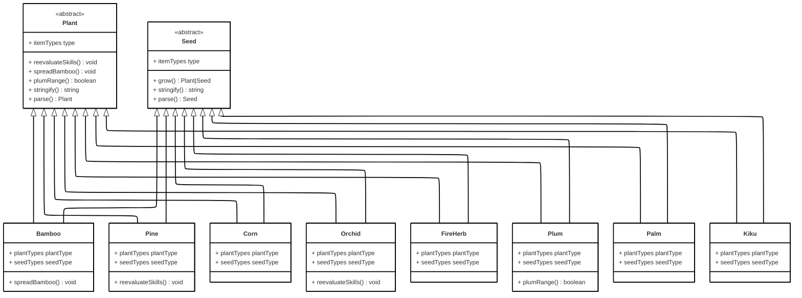
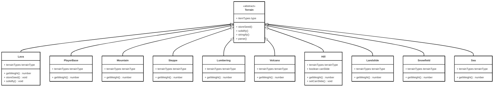
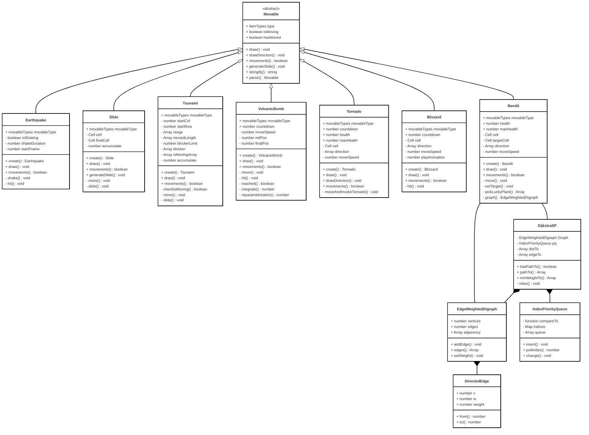
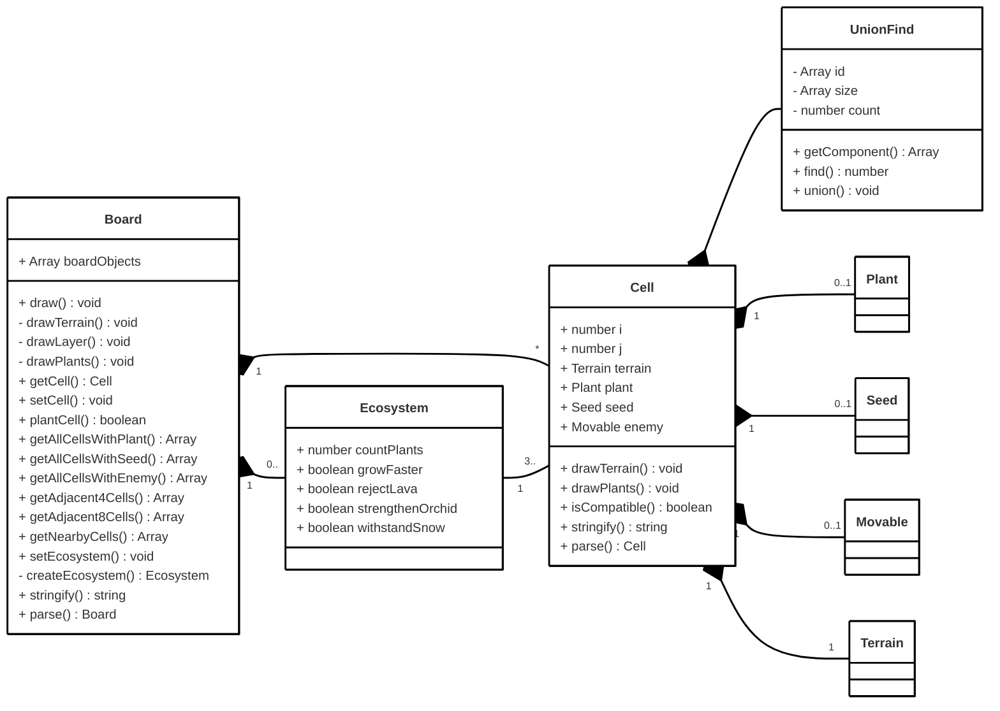
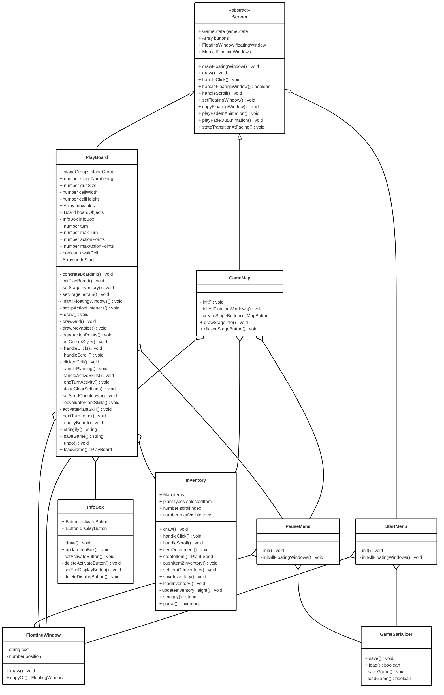

# 2025-group-12

[PLAY HERE](https://uob-comsm0166.github.io/2025-group-12/)

Chin Wei Liu, rq24239@bristol.ac.uk, Chin-pro, manager

Xiaoyu Wu, ni24070@bristol.ac.uk, wendywuxiaoyu

Fan Meng, xa24801@bristol.ac.uk, p1umage

Xiaobai Zheng, iu24160@bristol.ac.uk, wheeinside

Rui Zhang, xs24368@bristol.ac.uk, redial17

Zhenghao Yang, kj24716@bristol.ac.uk, saquantum

# Project Report

## Introduction

The Green Renaissance is a turn-based tactics chessboard game, emphasising the flexibility and diversity of gameplay strategies, as well as the intricacies of resource management. The elements of the game are introduced progressively, making it easy to comprehend and learn while escalating challenges as the game progresses, reflecting the interconnected nature of these elements. Thus, players are encouraged to create a thoughtful strategy that will help them succeed in the game. 

The background story of our game invites you to explore a world being rebuilt after the devastation caused by natural disasters. Various plants, which develop from seeds after several turns of being cultivated, are employed as our chess soldiers in the struggle against disasters. Although these plants cannot move after cultivation, they can acquire different skills and enhance their ability when cultivated in close proximity, forming an ecosystem. After each game stage, all surviving plants are moved to the player's inventory for use in later stages. It would be challenging if a player consumes too many or grows too few resources, requiring players to think carefully before making their moves.

We are not looking for a conventional Mario-genre 2D side-scrolling platform game, but rather something innovative. Our initial game idea is inspired by a similar tactics game, <em>Into the Breach</em>, where players control a group of mecha warriors on a grid battlefield, and a tower defence game, <em>Carrot Fantasy</em>, where players cultivate plants that fire ballistae, similar to <em>Plants vs. Zombies</em>. Both games focus on planning and strategy. Evolved from these games, our game stands out for its uniqueness (as far as our knowledge) in gameplay and mechanics, making it enchanting to players .

## Requirements 

  ### Ideation process & Early-stage designs
To decide what to develop, we first raised our initial requirements for the game during the first team discussion session, including:

  - A board game, whether grid-based or not.
    
  - First easy, but gradually becomes difficult.
    
  - Challenging to manage resources.
    
  - Two game phases: farming and combat.
  
  - With a suitable and magnificent art style and background story.
   
  - The game should be novel.
    

 Our scrum master then collects all the requirements, guiding us to a consensus. Team members are then assigned tasks to explore relevant game ideas. We kept a backlog and a short version on the kanban to remind ourselves. This process was repeated over several meetings, focusing on the game mechanism. During week 3’s workshop, we made two paper prototypes, which were later denied due to dissatisfaction with our requirements. However, they played important roles in integrating the final idea of the game mechanism by evaluating the pros and cons of the two prototypes. 

[insert video – paper prototype]

The paper prototype introduces the fundamental concept of our gameplay: cultivate different plants on the grid play board to form an ecosystem and strengthen the plants to defend against natural disasters.

Through in-depth discussions, the early-stage game framework is maintained until the final version. We utilised pair programming to develop a working prototype in the first sprint, and all team members tested it and contributed ideas for later refinement.

[insert video – early-stage working prototype]

### Identify stakeholders & user stories
We identified stakeholders and visualised their roles using an onion model diagram to represent their impact on our game. Concrete end users placed in the inner rings act as active surrogates, embodying different player personas to help shape and clarify our gameplay requirements.

The onion model diagram.

The requirements and acceptance criteria raised by our team as user stories are presented below.

  - As the developer, I want to balance time and effort so that the game project is submitted on time and with high-quality coding and art. Given the timeline and task list, when tasks are assigned during a sprint, then each team member should have a manageable workload.

  - As the unit lecturer, I want the game to demonstrate challenges and be fun and engaging so that the students contribute enough work to the project. Given the team’s report and code base, when the game is demonstrated, then it should reflect both technical and creative effort.

- As a first-time player, I want the game to be easy to start with so that I can understand the game mechanism quickly. Given that I have no previous strategy game experience, when playing the first several stages, then I can get used to both the mouse controls and the game mechanics.

- As a casual player, I don’t want any time or space limitations present in the game so that I can enjoy the game anytime. Given that I want to play anytime, when I want to quit the game but not lose progress, then I can save the game and load it later.

- As a hardcore player, I want the game to be joyful and challenging so that I can enjoy the game. Given that I have experience on other games, when I want some extra challenge, then the game provides an infinite mode.

- As a player with art requirements, I want to understand how artistic concepts are projected into games so that I can enjoy the game better. Given a game that uses stylised art themes, when I progress through scenes, then the visual and audio elements should reflect the intended artistic concept to improve immersion.

- As a natural plant lover, I want a plant-centred game that provides in-depth and rich plant knowledge, as well as some of the actual plant functions, so that the game has a complete and detailed illustration function. Given extra plant illustrations, when players click each picture, then it shows the plant prototype, family, genus, species, suitable planting environment, growth cycle, medicinal value and economic value.

- As an environmental enthusiast, I want the game to simulate real-life planting experiences with diverse environments and climate systems, so that it emphasises the importance of protecting green lives. Given the natural disasters from the game, when I’m playing the game, then they should behave like real-life counterparts.

### Reflection on epics, user stories and acceptance criteria

Requirements-driven engineering defines clear boundaries for the final product and specifies one direction for development. One of the user stories states that the game should be easy to learn. It is then broken down into manageable tasks for us to accomplish, including adding floating windows for hints, designing the game board and enemies carefully, introducing the undo feature to improve tolerance for mistakes, designing user-friendly UI, etc. By pre-defining all tasks on the kanban, we establish a clear path and priority for implementing these features, greatly enhancing our efficiency.

Epics and user stories vaguely outline boundaries for the product on different scales, while acceptance criteria shape them to become more precise. “Adding floating windows” is indeed helpful, but what kind of floating windows? In the acceptance criterion for it, we must define clear constraints on all the elements: positioning, sizing, font size, colour, text wrapping, text wording… Once the criterion is met, we can confidently tick the task off the kanban.
 
Requirements themselves alter during agile engineering. When coding our game, the five game stages (Tornado, Volcano, Earthquake, Blizzard, Tsunami) did not suddenly appear out of nowhere. Initially, we only decided the first stage would focus on tornadoes since all core game features are involved, and it is not too hard to realise. After implementing and testing the functionalities thoroughly, we then moved on to discussions on designing later stages, where new requirements arise, and even potential modifications to existing requirements. Our game iterates and evolves from a mere working prototype into a complete game through filling in and refining the requirements.

### Use case diagram & Use case specification
To illustrate the flow of player actions to guide us in programming and visualise the game process, we have drawn the following use case diagram.

The use case diagram.

These use cases are detailed as follows:
  - Enter Game: The player enters the game and is located at the main start menu.

  - New Game: Start the game from the first game stage by clicking the ‘New Game’ button at the main menu.
  
  - Load Game: Load save data to continue playing by clicking the ‘Load Game’ button at the main menu.
  
  - Play: Click the next stage from the game map menu, then the player goes into the play board. Includes several actions the player can perform, or choose to do nothing and stay at this stage.
  
  - Cultivate: Click an item from the inventory, then click a grid cell to cultivate it.
  
  - Activate Skills: Click the activate button, then click a target from the board to activate skills of the plants.
  
  - End Turn: Click the turn button to go to the next turn.
  
  - Enemy Movements: After the turn button is clicked, if there are enemies on the board, they start to move and attack. Automatically goes to the next turn once all enemies have moved, or clears the current stage if the win condition is satisfied.
  
  - Plants Attacked: Plants only get hit when enemies are moving.
  
  - Base Attacked: Game Over if an enemy attacks the player's base.
  
  - Game Over: The player is thrown back to the game map menu and can retry the game stage.

## Design

- 15% ~750 words 
- System architecture. Class diagrams, behavioural diagrams. 

The class diagram for plants and seeds.

The class diagram for terrain.

The class diagram for movables.

The class diagram for boards and cells. Refer to previous class diagrams to examine plants, seeds, terrains and movables.

The class diagram for game screens.

The class diagram for the game state and wiring.

## Implementation

- 15% ~750 words

- Describe implementation of your game, in particular highlighting the three areas of challenge in developing your game.

## Evaluation

- 15% ~750 words

- One qualitative evaluation (your choice) 

  The heuristic evaluation of the game project identified several critical issues affecting usability, gameplay intuitiveness, and strategic clarity. The most severe issues (Severity ≥ 3.67) include **unclear core mechanics**, where players struggle to grasp fundamental gameplay concepts, requiring improved tutorials and visual guidance. Additionally, **the stamina bar only becomes visible in the second level’s second round**, which can disrupt strategic planning; this should be addressed by introducing it earlier. Another major concern is **unclear disaster and enemy movement logic**, which hinders strategic decision-making and could be resolved through better visual indicators. Furthermore, **resource values lack explicit meaning (Magic Number issue)**, requiring clearer numerical representations. Lastly, **the steep difficulty gap between the tutorial and the first level** makes it difficult for new players to transition smoothly.  

  For medium-priority issues (Severity 3.00 - 3.33), improvements should be made in **diversifying victory conditions**, separating **hints from annotations for better readability**, and allowing **players to change plant selections** after clicking. Additionally, **bugs causing automatic turn skips** and the **lack of an undo function** significantly impact gameplay flow and should be resolved. Implementing these changes will enhance game accessibility, improve strategic depth, and create a smoother onboarding experience for new players.

- One quantitative evaluation (of your choice) 

- Description of how code was tested. 

## Process 

- 15% ~750 words

- Teamwork. How did you work together, what tools did you use. Did you have team roles? Reflection on how you worked together. 

## Conclusion

- 10% ~500 words

- Reflect on project as a whole. Lessons learned. Reflect on challenges. Future work. 

## Contribution Statement

- Provide a table of everyone's contribution, which may be used to weight individual grades. We expect that the contribution will be split evenly across team-members in most cases. Let us know as soon as possible if there are any issues with teamwork as soon as they are apparent. 

## Additional Marks

You can delete this section in your own repo, it's just here for information. in addition to the marks above, we will be marking you on the following two points:

- **Quality** of report writing, presentation, use of figures and visual material (5%) 
  - Please write in a clear concise manner suitable for an interested layperson. Write as if this repo was publicly available.

- **Documentation** of code (5%)

  - Is your repo clearly organised? 
  - Is code well commented throughout?
