<div align="center">
<h1>2025-group-12</h1>
</div>

<p align="center">
    <a href="https://uob-comsm0166.github.io/2025-group-12/" target="_blank">
        
    </a>
</p>

<p align="center">
Click the banner to play our game.
</p>

---

<div align="center">
    <a href="https://www.youtube.com/watch?v=ZiUGkE-snPQ" title="Watch the Game Demonstration">
        
    </a>
    <p>
        Find a game demonstration of the <strong>Green Renaissance</strong> game above, providing a brief overview of the gameplay mechanics and the development process. This video will give you a sneak peek into the exciting challenges!
    </p>

</div>

<p align="center">
    <br>
    <a href="https://www.youtube.com/watch?v=ZiUGkE-snPQ" target="_blank" rel="noopener">Click here to watch the introductory VIDEO.</a>
    <br>
</p>

---

<p align="center">
    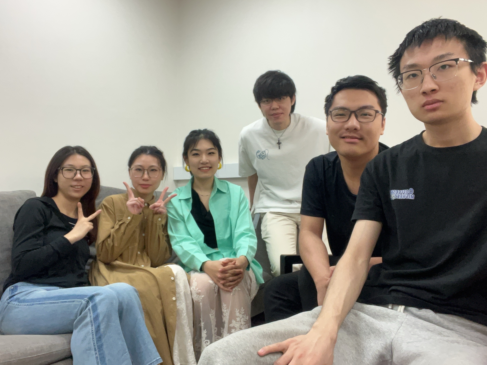
</p>


| Name          | UOB@email             | github@username | Role                                   |
| ------------- | --------------------- | --------------- | -------------------------------------- |
| Chin Wei Liu  | rq24239@bristol.ac.uk | Chin-pro        | Scrum master, lead developer           |
| Xiaobai Zheng | iu24160@bristol.ac.uk | wheeinside      | lead art designer, developer           |
| Fan Meng      | xa24801@bristol.ac.uk | p1umage         | art designer, developer                |
| Xiaoyu Wu     | ni24070@bristol.ac.uk | wendywuxiaoyu   | documentation management, art designer |
| Rui Zhang     | xs24368@bristol.ac.uk | redial17        | developer, testing                     |
| Zhenghao Yang | kj24716@bristol.ac.uk | saquantum       | developer, testing                     |

---

# Table of Contents
- [1. Introduction](https://github.com/UoB-COMSM0166/2025-group-12?tab=readme-ov-file#introduction)
- [2. Design](https://github.com/UoB-COMSM0166/2025-group-12?tab=readme-ov-file#design)
- [3. Requirements](https://github.com/UoB-COMSM0166/2025-group-12?tab=readme-ov-file#requirements)
- [4. Implementation](https://github.com/UoB-COMSM0166/2025-group-12?tab=readme-ov-file#implementation)
- [5. Evaluation](https://github.com/UoB-COMSM0166/2025-group-12?tab=readme-ov-file#evaluation)
- [6. Process](https://github.com/UoB-COMSM0166/2025-group-12?tab=readme-ov-file#process)
- [7. Sustainability, Ethics and Accessibility](https://github.com/UoB-COMSM0166/2025-group-12?tab=readme-ov-file#sustainability-ethics-and-accessibility)
- [8. Conclusion](https://github.com/UoB-COMSM0166/2025-group-12?tab=readme-ov-file#conclusion)


# Project Report

## Introduction

The Green Renaissance is a turn-based tactics chessboard game, emphasising the flexibility and diversity of gameplay strategies and the intricacies of resource management. Our game gradually introduces elements with explanations, making it easy to comprehend and learn while escalating challenges as the game progresses. Players are encouraged to investigate the interconnections between the game components and devise a thoughtful strategy to win the game.

The background story of our game invites you to delve into a world rebuilding after the devastation caused by natural disasters. Various plants, which develop from seeds after several turns of being cultivated, are employed as our chess soldiers in the struggle against disasters. Although these plants cannot move after cultivation, they can acquire different skills and enhance their ability when cultivated closely, forming an ecosystem. After each game stage, all surviving plants are moved to the player's inventory for use in later stages. It would be challenging if a player consumes too many or grows too few resources, requiring players to think carefully before making their moves.

We are not looking for a conventional Mario-genre 2D side-scrolling platform game, but rather something innovative. Our initial game idea is inspired by a similar tactics game, <em>Into the Breach</em>, where players control a group of mecha warriors on a grid battlefield, and a tower defence game, <em>Carrot Fantasy</em>, where players cultivate plants that fire ballistae, similar to <em>Bloons TD</em>. Both games focus on planning and strategy. Evolved from these games, our game stands out for its uniqueness (as far as our knowledge) in gameplay and mechanics, making it enchanting to players .


## Requirements 

  ### Ideation process & Early-stage designs
To decide what to develop, we first raised our initial requirements for the game during the first team discussion session, including:

  - A board game, whether grid-based or not.
    
  - First easy, but gradually becomes difficult.
    
  - Challenging to manage resources.
    
  - Two game phases: farming and combat.
  
  - With a suitable and magnificent art style and background story.
   
  - The game should be novel.
    

 Our scrum master then collects all the requirements, guiding us to a consensus. Team members are then assigned tasks to explore relevant game ideas. We kept a backlog and a short version on the kanban to remind ourselves. This process was repeated over several meetings, focusing on the game mechanism. During week 3’s workshop, we made two paper prototypes, which were later denied due to dissatisfaction with our requirements. However, they played important roles in integrating the final idea of the game mechanism by evaluating the pros and cons of the two prototypes. 

<p align="center">
    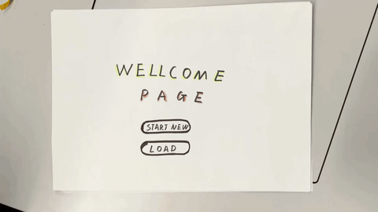
</p>

<p align="center">
The paper prototype demonstration. <a href="documents/paperprototype.mp4">Video</a>
</p>

The paper prototype introduces the fundamental concept of our gameplay: cultivate different plants on the grid play board to form an ecosystem and strengthen the plants to defend against natural disasters.

Through in-depth discussions, the early-stage game framework is maintained until the final version. We utilised pair programming to develop a working prototype in the first sprint, and all team members tested it and contributed ideas for later refinement.

<p align="center">
    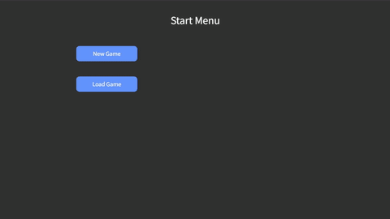
</p>

<p align="center">
The early stage prototype demonstration. <a href="documents/prototypedemo.mp4">Video</a>
</p>


### Identify stakeholders & user stories

We identified stakeholders and visualised their roles using an onion model diagram to represent their impact on our game. Concrete end users placed in the inner rings act as active surrogates, embodying different player personas to help shape and clarify our gameplay requirements.

<p align="center">
    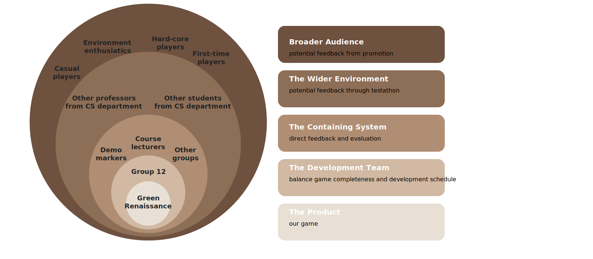
</p>

<p align="center">
The onion model diagram.
</p>


The requirements and acceptance criteria raised by our team as user stories are presented below.

  - As the developer, I want to balance time and effort so that the game project is submitted on time and with high-quality coding and art. Given the timeline and task list, when tasks are assigned during a sprint, then each team member should have a manageable workload.

  - As the unit lecturer, I want the game to demonstrate challenges and be fun and engaging so that the students contribute enough work to the project. Given the team’s report and code base, when the game is demonstrated, then it should reflect both technical and creative effort.

- As a first-time player, I want the game to be easy to start with so that I can understand the game mechanism quickly. Given that I have no previous strategy game experience, when playing the first several stages, then I can get used to both the mouse controls and the game mechanics.

- As a casual player, I don’t want any time or space limitations present in the game so that I can enjoy the game anytime. Given that I want to play anytime, when I want to quit the game but not lose progress, then I can save the game and load it later.

- As a hardcore player, I want the game to be joyful and challenging so that I can enjoy the game. Given that I have experience on other games, when I want some extra challenge, then the game provides an infinite mode.

- As a player with art requirements, I want to understand how artistic concepts are projected into games so that I can enjoy the game better. Given a game that uses stylised art themes, when I progress through scenes, then the visual and audio elements should reflect the intended artistic concept to improve immersion.

- As a natural plant lover, I want a plant-centred game that provides in-depth and rich plant knowledge, as well as some of the actual plant functions, so that the game has a complete and detailed illustration function. Given extra plant illustrations, when players click each picture, then it shows the plant prototype, family, genus, species, suitable planting environment, growth cycle, medicinal value and economic value.

- As an environmental enthusiast, I want the game to simulate real-life planting experiences with diverse environments and climate systems, so that it emphasises the importance of protecting green lives. Given the natural disasters from the game, when I’m playing the game, then they should behave like real-life counterparts.

### Reflection on epics, user stories and acceptance criteria

Requirements-driven engineering defines clear boundaries for the final product and specifies one direction for development. One of the epics states that the game should be easy to learn. It is then broken down into user stories for us to accomplish, including adding floating windows for hints, designing the game board and enemies carefully, introducing the undo feature to improve tolerance for mistakes, designing user-friendly UI, etc. By pre-defining all tasks on the kanban, we establish a clear path and priority for implementing these features, greatly enhancing our efficiency.

Epics and user stories vaguely outline boundaries for the product on different scales, while acceptance criteria shape them to become more precise. “Adding floating windows” is indeed helpful, but what kind of floating windows? In the acceptance criterion for it, we must define clear constraints on all the elements: positioning, sizing, font size, colour, text wrapping, text wording… Once the criterion is met, we can confidently tick the task off the kanban.

Requirements themselves alter during agile engineering. When coding our game, the five game stages (Tornado, Volcano, Earthquake, Blizzard, Tsunami) did not suddenly appear out of nowhere. Initially, we only decided the first stage would focus on tornadoes since all core game features are involved, and it is not too hard to realise. After implementing and testing the functionalities thoroughly, we then moved on to discussions on designing later stages, where new requirements arise, and even potential modifications to existing requirements. Our game iterates and evolves from a mere working prototype into a complete game through filling in and refining the requirements.

### Use case diagram & Use case specification
To illustrate the flow of player actions to guide us in programming and visualise the game process, we have drawn the following use case diagram.

<p align="center">
    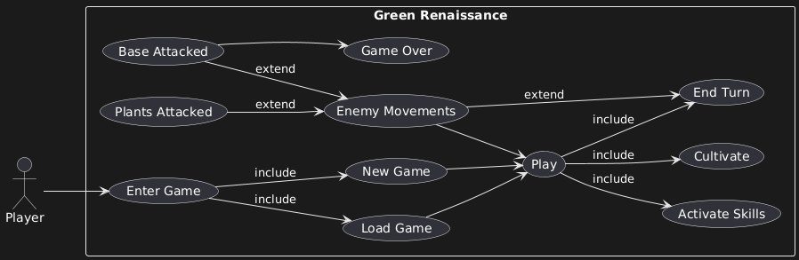
</p>

<p align="center">
The use case diagram.
</p>


These use cases are detailed as follows:
  - Enter Game: The player enters the game and is located at the main start menu.

  - New Game: Start the game from the first game stage by clicking the ‘New Game’ button at the main menu.
  
  - Load Game: Load save data to continue playing by clicking the ‘Load Game’ button at the main menu.
  
  - Play: Click the next stage from the game map menu, then the player goes into the play board. Includes several actions the player can perform, or choose to do nothing and stay at this stage.
  
  - Cultivate: Click an item from the inventory, then click a grid cell to cultivate it.
  
  - Activate Skills: Click the activate button, then click a target from the board to activate skills of the plants.
  
  - End Turn: Click the turn button to go to the next turn.
  
  - Enemy Movements: After the turn button is clicked, if there are enemies on the board, they start to move and attack. Automatically goes to the next turn once all enemies have moved, or clears the current stage if the win condition is satisfied.
  
  - Plants Attacked: Plants only get hit when enemies are moving.
  
  - Base Attacked: Game Over if an enemy attacks the player's base.
  
  - Game Over: The player is thrown back to the game map menu and can retry the game stage.


## Design

Our game adopts RESTful and composition-over-inheritance design patterns, enhancing modularity and testability. In early versions, our game followed the conventional OOP design pattern using ES modules. Under that framework, it was impossible to use the Jest library to test our code, as everything was tangled together; even worse, Jest detected circular dependencies. We then refactored our code using a universal container to achieve dependency injection (DI) and inversion of control (IoC). 

Four layers present in our game design: model, logic, render and persistence. The hierarchy of them, from top to bottom, is:

- Render

- Service

- Model

- Persistence

Upper layers have access to lower layers, but not vice versa. The render layer is where `p5.js` operates, and the player interacts directly with it. By separating this, the renderer becomes a plugin to the system, allowing us to switch to another visualization library instead of `p5.js` at any time. The service layer manages general game logic. Except for action listeners, the entry point to all logic is the `mainLoopEntry()` function from the `Controller` class, which is invoked by the `p5.js` main loop's `draw()`. The model layer stores data. The persistence layer consists of serializers that execute saving and loading. In our class diagrams, we combine the four layers of one target class into a complete class, and the object-oriented perspective remains helpful and intuitive.

Although stated in the class diagrams, the concrete plant and seed classes do not explicitly inherit from the abstract class `Plant` or `Seed`. With composition, we inject the "superclass" into the "subclass", and assign all properties of the "superclass" to the "subclass", complying with the composition-over-inheritance philosophy. A similar practice applies to terrain and movable classes.

<p align="center">
    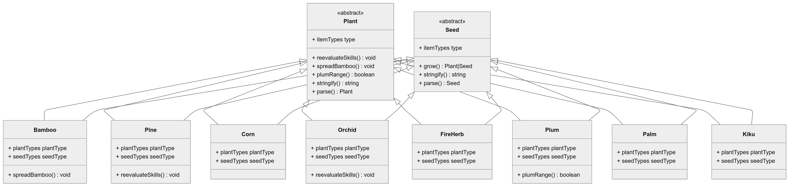
</p>

<p align="center">
The class diagram for plants and seeds.
</p>

<p align="center">
    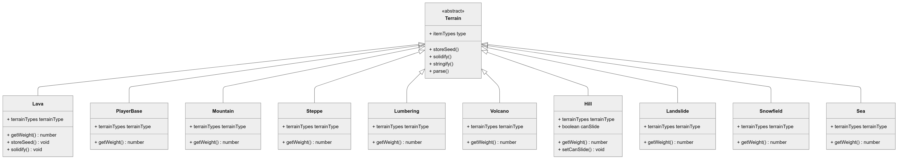
</p>

<p align="center">
The class diagram for terrain.
</p>

<p align="center">
    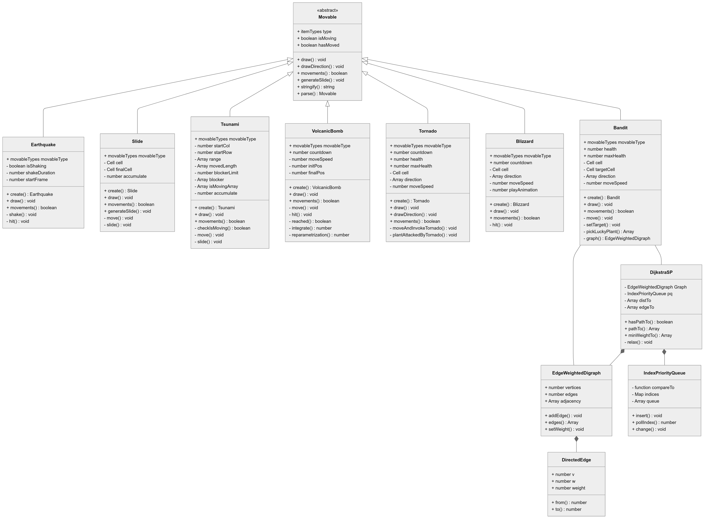
</p>

<p align="center">
The class diagram for movables.
</p>

Board and cells make up the actual play board. Every cell in the grid is a dependent object and is stored in a 2D array within a board object. When three or more different kinds of plants are cultivated together, the board detects this through the `setEcosystem()` method and tries to build an ecosystem; thus, the association between the ecosystem and cell is"1--3..".

<p align="center">
    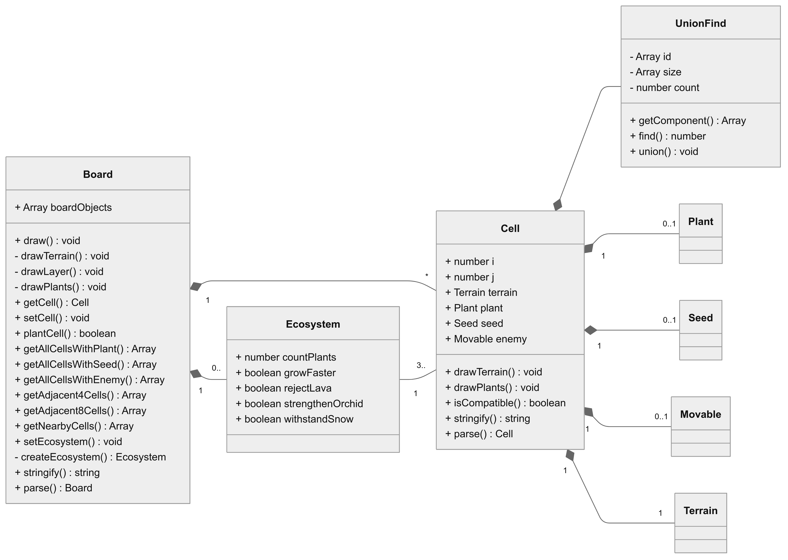
</p>

<p align="center">
The class diagram for boards and cells. Refer to previous class diagrams to inspect Plant, Seed, Terrain and Movable.
</p>

The main game menus are `StartMenu`, `GameMap`, and `PlayBoard`, which represent the three screens a player would encounter in the game, along with some helper menus. The player's inventory can be viewed from both the map menu and the play board, and it can be interacted with on the play board; however, the inventory is stored in the central `GameState` object.

<p align="center">
    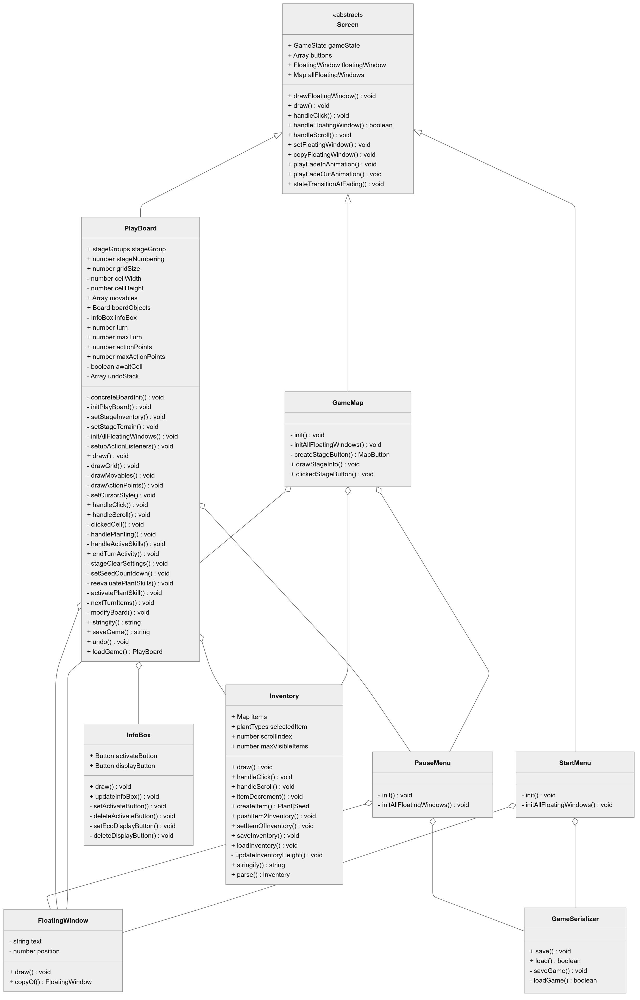
</p>

<p align="center">
The class diagram for game screens.
</p>

The `Controller` and `GameState` resemble the controller and model in the MVC design pattern, although here they only handle general logic and offer an entry point. The `GameState` keeps the current state, current play board, and cleared stages. The `Controller` gathers logic from menus and distributes the responsibility to separate menus. The container defines all dependencies and wires them up by passing a `bundle` object consisting of all required components through static `setup` methods, realising DI and IoC by handing over the right to control to the container, subsequently preventing circular dependency. The main class imports the container and defines the p5 object, which serves as the entry point to all other classes.

<p align="center">
    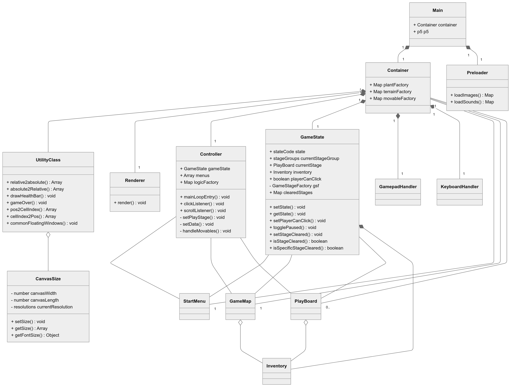
</p>

<p align="center">
The class diagram for the game state and wiring. Refer to previous class diagrams to inspect StartMenu, GameMap, PlayBoard and Inventory.
</p>

A reminder: the class diagrams only cover key fields and methods, as well as the sequence diagram covering only the core data flow. It would be unreadable if we included everything.

To understand the sequence diagram, we can split it into three parts: action listeners, data management, and rendering. A click event will first be passed into the controller and dispatched to the current working menu. Resolving the logic of the component being clicked might trigger state transitions, which will be recorded in the game state and wait until the next frame to process. If the player is unable to click (after the player clicks the "turn" button), the action listeners will be switched off. In the main loop, the controller first tries to initialise the play board if we go to the `PLAY` phase from the game map menu. Then, the controller loads or saves the items in the inventory, since when the player quits the game, we would like to restore the inventory. When the player is unable to click, the controller tries to invoke all movables from the play board and automatically sets the player able to click once all movables have moved. The last rendering part is self-documented and calls all rendering components.

<p align="center">
    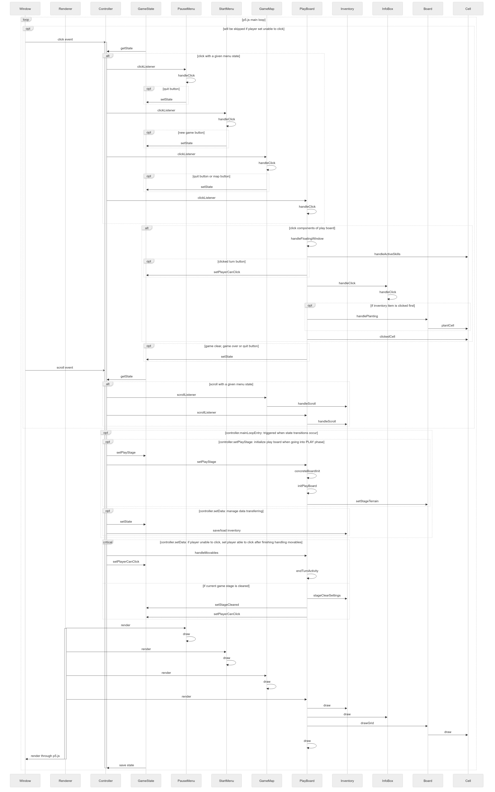
</p>

<p align="center">
The sequence diagram.
</p>


## Implementation

The implementation of our game began with a compact prototype of approximately 500 lines, and you might find it [here](https://github.com/UoB-COMSM0166/2025-group-12/tree/b96b243647b2beae682a0bd166cff66edbe65f59/docs) containing these files:

```
 |- / assets
     |- images
 |- / lib
 |- / src
     |- Main.js
     |- CanvasSize.js
     |- Preloader.js
     |- / controller
         |- Controller.js
     |- model
         |- GameState.js
         |- Inventory.js
         |- StartMenu.js  (named after Menu.js)
         |- GameMap.js    (named after Standby.js)
         |- PlayBoard.js  (named after Play.js)
     |- items
         |- Tree.js
         |- Bush.js
         |- Grass.js
         |- Button.js
```

In this minimal prototype, the player can navigate between menus and perform basic cultivation. We incrementally released new features, including artwork, plant skills, enemy movements handling and so on, while keeping the game working through week-based sprints. Rather than designing everything up front, the architecture evolves in response to modifications to game requirements, allowing us to test and refine individual features in isolation.
However, as the game expands, many challenges emerge, such as the interactions among multiple game items, the design of general flow control, the switching on and off of our hand-made animations, the balancing between computational optimisation and code simplicity, etc. Here we pick the two most emblematic challenges, presented below.

### Challenge 1 - Decoupling complexity

As the game scale increases, it becomes exponentially harder to maintain the codebase. Circular dependencies inevitably arise, and encapsulation and modularisation under the conventional OOP design pattern lose significance since everything is intertwined. At its worst, serialisation of the game state exposes deep structural flaws: The plants on the play board reside on the `Cell` objects. To parse JSON strings, the `Cell` must import all modules of the plants. Some plants, to manage interactions among items, import the `PlayBoard` module, which already depends on `Cell`, leading to a circular dependency. Despite resolving this issue, one of our philosophies, that dispatching responsibilities to lower levels and keeping the top-level entry points as clean as possible results in a self-documented codebase, is violated.

To regain maintainability, two approaches are adopted in parallel.

- Enforce module boundaries.
  
    Logic and orchestration are separated. The `PlayBoard` class is not supposed to directly handle plant logics. Instead, it delegates to the general interface `Plant`, which invokes concrete logic components from each plant module. This separation enables us to maintain both the control flow and the logic independently, facilitating enhanced reasoning and extension.

- Enforce loose coupling.
  
    A module does not concern itself with how other modules are implemented; all are treated as interfaces and injected by the container instead of hard-wiring import statements. This approach enhances the flexibility of the codebase, simplifies the process of refactoring or replacing a module, and aligns with the open-closed principle: open to extension, closed to modification.
    
    <p align="center">
      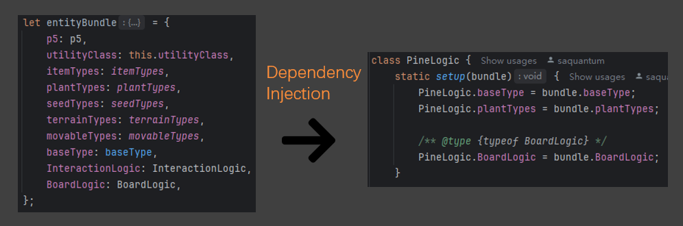
    </p>


<p align="center">
The demonstration code chunks for implementing dependency injection.
</p>


### Challenge 2 - Implementation of serialisation

To enhance the player experience, we introduced undo and save & load features. However, "repairing a mirror is always harder than smashing it" — restoring game state is about reversing entropy. Consider the game as a finite state machine. Each action is a nondeterministic traversal down the finite decision tree. Since we cannot predict future branches, restoring the correct game state becomes a non-trivial problem. 
Two major approaches can be applied to restore a game state:

- Replay all actions taken by the player from the beginning.

- Snapshot the entire game state and completely restore it.

While the first approach is conceptually simpler in our context and is closer to real gameplay, it comes with high computational costs. We adopted the second approach, which turned out to be challenging due to the deeply nested structure of our game objects.
Here is how we incrementally tackled this bottom-up. First, we implemented `stringify` and `parse` methods for all game items - plants, seeds, terrains and movables. Most items only contain primitive-like fields (numbers and strings), leading to a straightforward serialisation, but there are exceptions: some movables need a `cell` field, which is of a custom reference type `Cell`. To address this, we stored the x and y coordinates of the cell and restored the reference type object by accessing the correct position on the board when parsing. 

After testing the first step, we then introduced the in-play `undo` feature by pushing the JSON strings into a stack. Every invocation of `undo()` pops from the stack, recreates new game items according to the JSON string. To optimise, we did not serialise and restore everything – for example, ecosystems are completely ignored when stringifying, but are recalculated by invoking the `setEcosystem` method. This is more inclined to hybridise the two major approaches of save & load we described above, to minimise the possibility of introducing subtle bugs while improving performance. Lastly, we expanded the system to the whole game state, enabling the player to save the game in-play, then quit to the start menu and load the game. 

<p align="center">
  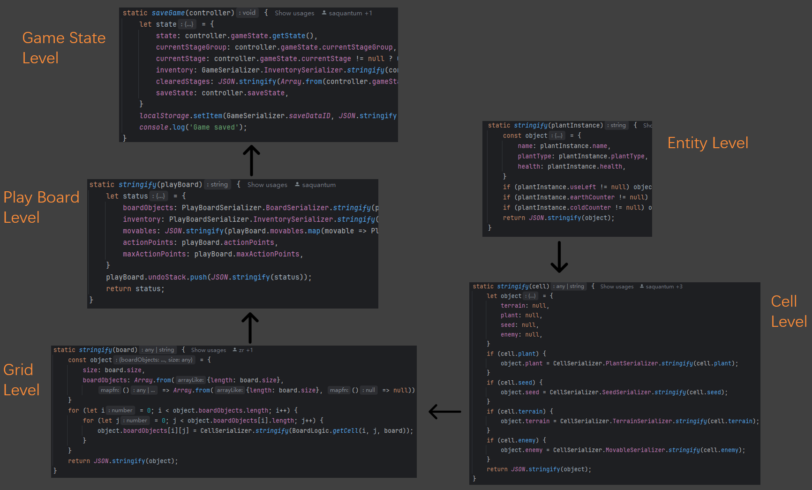
</p>

<p align="center">
The demonstration code chunks for implementing serialisers. Upper level serialisers recursively calls lower level serialisers.
</p>


## Evaluation

We conducted qualitative and quantitative evaluations to find potential issues that affect user experiences. 

### Qualitative evaluation: Heuristics

Among the two major approaches, the think-aloud and Nielsen’s heuristic, we selected the analytical heuristic method to enhance coverage. Twenty-four issues were discovered, most of which are related to the game’s UI/UX and gameplay interface. Beyond identifying the issues and broken heuristics, we also allowed users to rate the frequency, impact, and persistence level, ranging from 0 to 4, providing insight into the severity of the issues. The raw data can be found [here](https://github.com/UoB-COMSM0166/2025-group-12/blob/main/documents/Heuristic%20Evaluation.md). Some of the issues are identified due to maloperation or skipping some tutorials. Let’s review the filtered issues according to the heuristics evaluators found violated, ordered by severity.

<table>
  <tr>
    <td>
      <figure>
        
        <figcaption>
          <small>
            Statistics of usability issues across all participants
          </small>
        </figcaption>
      </figure>
    </td>
    <td>
      <figure>
        
        <figcaption>
          <small>
            Percentage distribution across Nielsen’s ten heuristics
          </small>
        </figcaption>
      </figure>
    </td>
  </tr>
</table>


#### Help & documentation

- “Players with turn-based tactics experience adapt quickly, while new players struggle with a steep learning curve”

- “Lack of ecosystem hints, affecting strategy formulation”

- “Missing Help Button, making it difficult for players to get quick assistance”

- “Gameplay is not intuitive, and core mechanics are unclear”

- “The logic of natural disasters and enemy directions is unclear, affecting strategic planning”

- “Significant difficulty gap between the tutorial and the first level, impacting new player experience”

Players without experience in tactics games tend to give feedback concerning the “confusing” game process. We have introduced helpful floating windows and redesigned the tutorial game stages to alleviate these usability concerns. However, we encourage players to engage and dive deeply into the game mechanics and explore them, instead of us explaining everything explicitly.

#### User control & freedom

- “Players should be able to withdraw a recently planted plant to increase strategic flexibility”

We have already addressed this issue by introducing the undo and save & load features, which are elaborated on in previous chapters.

#### Recognition Rather Than Recall

- “Hovering or clicking should display corresponding hints”

We didn’t know how to provide information on game entities previously. Thanks to this insightful advice, we have introduced a hovering floating window to explain the details of a game entity.

### Quantitative evaluation: NASA TLX

To triangulate the purely expert-driven findings with players' perception, we administered the System Usability Scale (SUS) and the NASA Task Load Index (NASA-TLX) to twelve participants who completed both the tutorial (easy) and a genuine game stage (hard). We present here the results of the NASA TLX evaluation.

<p align="center">
        
</p>

<p align="center">The NASA TLX workload score across all participants.</p>


Notice from the table that some users found the tutorials even more demanding than later game stages. These users with extensive game experience suggested through interviews that the tutorials are verbose and easy to understand. From the table, we clearly see that physical or temporal demands are significantly lower than those of others, yet there are commonly high mental demands, which aligns with our game design. The performance, effort and frustration indicators vary intensely among different users, depending on their interest or previous experience in our game's genre.

The result of the Wilcoxon signed rank test shows a `W=4.5`, which is less than the critical value at the 99.5% significance level (which is 5 for `N=12`), indicating a difficulty gap between tutorial stages and genuine no-hint game stages.

### Testing

We test our app with two approaches:

- Direct interactions with the app through a browser
  
- Using Node.js testing libraries to implement code-aware tests
  

The first approach is easy but, more importantly, necessary to conduct, as there is no simple way to test the rendering outcome of the p5.js library. Focusing primarily on non-functional requirements, we test graphics and apparent logical bugs by playing through the game, following the game process and treating it as a complete black box.

The second approach is more robust and reliable, but much harder to fully execute. The test codebase can be found [here](https://github.com/UoB-COMSM0166/2025-group-12/tree/main/docs/lib/__test__). We skipped the white box testing for functions since there are too many of them (refer to our class diagrams) that we can’t go through all the statements and branches within the term schedule. We ensure the overall correctness of the system by using black box testing and equivalent partitioning. Each individual menu is treated as a functional unit, and we use mock play boards, game entities, mouse inputs and keyboard inputs to the system to test reactions. A rule of thumb raised by our team that “the test code should be larger than the production code” is also violated due to our large codebase (~12000 lines) and term dates. However, we still ensure that the tests cover as many parameter categories as possible – as the game scales, the complexity grows exponentially, and we can only ensure the system is close to a bug-free status by iterating test suites.

<p align="center">
  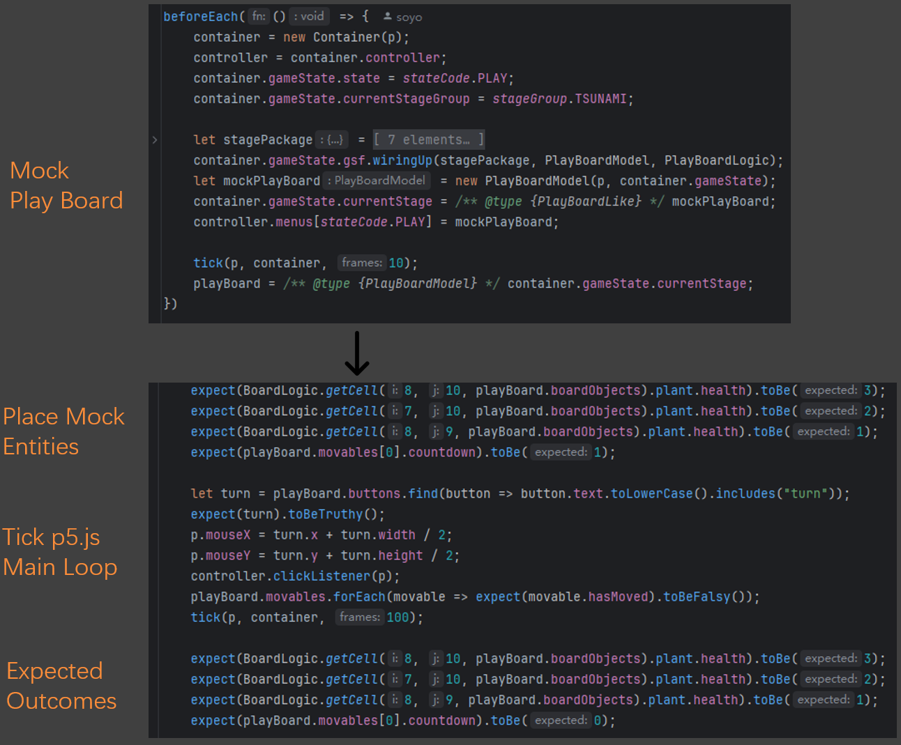
</p>

<p align="center">
The demonstration code chunks for test cases.
</p>


## Process 

Amongst all Agile approaches, our team in particular utilised the Scrum methodology in particular and sprint feedback loops to manage the collaborative development of our game project. Given the uncertainties around game design and the highly iterative nature of development, we found that flexible but structured collaboration practices were key to maintaining both efficiency and quality.

The development process, however, was not always smooth, especially for a self-organising team requiring discipline. When a team member become lazy or complacent, the overall progress is delayed due to unfinished key components, placing a greater burden on others. Meanwhile, the significant time commitment for daily stand-ups and sprint retrospectives feels excessive and often ends without a conclusion.

#### Sprint & Scrum

We set the length of one sprint cycle to one week, based on the term schedule and our development team’s working efficiency. Keeping sprints short and even a bit cramped forced us to prioritise tasks carefully, focusing only on items that offered the most value relative to the required effort. After each sprint cycle, we scheduled a 45-minute sprint retrospective meeting at 1 PM on Tuesday in the Merchant Venturers Building. These retrospectives provided an important opportunity for all team members to reflect on the sprint, share their individual progress, and discuss any technical challenges they encountered.

<p align="center">
    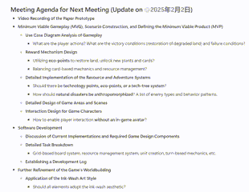
</p>

<p align="center">
    Our meeting agendas and minutes.
</p>

Since our game concept was brand new and largely undefined at the start, the entire team, acting as the product owner, discussed new game features to implement and documented them in the product backlog. These features were later added to the Kanban by the scrum master. Additionally, a draft of the class diagrams for new game elements was produced during this process, ensuring that everyone had a clear design model to follow, and detailed tasks were then assigned to each team member.

We abandoned Planning Poker while initially considering using it to estimate task complexity. The reason was the structured nature of our gameplay design, where the core data flow was already established during the reading week, leaving us to focus on implementing five distinct game stages—exactly one per sprint. (It turns out that our 'structured gameplay' was a glorified to-do list.)

#### Direct communication over Kanban

Since our coding team is relatively small and the residential areas of our team members are quite distant from the university and separate, we relied heavily on online instant messaging through WeChat, similar to WhatsApp, for day-to-day communication. While GitHub was used for version control, we preferred to announce and discuss updates directly through WeChat rather than set up formal pull requests, allowing us to maintain fast communication and reduce delays caused by individual work schedules. 

The Kanban board was used as a visual aid to track sprint tasks and remind the team of pending work, a reliable helper in the process of our teamwork. A team member who delivered code, graphics work, or documentation to the GitHub repo would directly inform everyone else in the WeChat group. After validation and verification, the scrum master would tick that term off the Kanban.

<p align="center">
    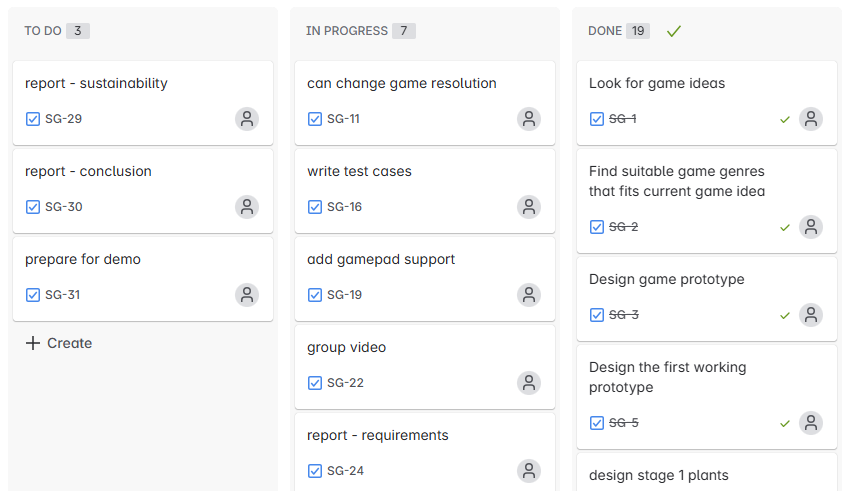
</p>

<p align="center">
    Our Kanban.
</p>

Nonetheless, the Kanban board proved to be essential for visibility over task progress, keeping all team members updated on sprint priorities, and quickly incorporating new ideas from the team. Proposed ideas were initially recorded on the Kanban board, then discussed and validated during sprint retrospectives before being added to future sprint tasks.

#### Pair programming 

Pair programming played a crucial role in the early stages of our game development, particularly in creating the initial working prototype and establishing the basic game components. At that time, the framework and structure of the game were still evolving, and many uncertainties remained to be addressed. Working in pairs allowed us to combine our individual strengths, share ideas more effectively, and quickly evaluate the pros and cons of different frameworks through active discussion. This collaborative approach led to a more consistent, adaptable, and durable codebase that could grow and improve as the project matured.

<p align="center">
    
</p>

Moreover, pair programming also proved especially valuable during debugging sessions. Locating the source of bugs can often be a time-consuming and frustrating task when working alone, especially with complex game mechanics and interactions. However, collaborating allowed us to analyse the bug from different perspectives, which sped up the process.

#### Code review & Peer feedback

We used an informal but effective peer feedback system to ensure code quality without introducing significant overhead. After pushing code to the GitHub repository, developers would immediately notify the rest of the team through our group chat. Other members were encouraged to pull the latest changes to test the new features locally and provide feedback or suggestions immediately. This asynchronous review process allowed us to maintain a rapid development pace while still identifying bugs, optimising designs, and ensuring coding standards across different parts of the project. 

## Sustainability, ethics and accessibility

### Environmental

Our game, the Green Renaissance, is closely tied to the environment. This natural disaster-inspired strategy game is designed to encourage players to pay attention to the natural environment. The core mechanism of the game is based on real natural disaster phenomena, such as sandstorms and earthquakes, and restores different ecological communities through frequent disasters like deserts, volcanoes, and seashores, presented in a pixel style. During the player's experience, the design team used real-named natural tree species and incorporated the process of seedlings growing into mature plants into the game design and art, allowing players to experience biodiversity and succession in natural systems more intuitively.

The game also features a special mechanism inspired by the principle of ecosystem diversity: when players cultivate three plants of different types, a unique “Ecosystem” is formed, which has stronger resistance and growth advantages than monoculture. This mechanism also conveys ecological knowledge to players, allowing them to understand the importance of diversity in their strategic experience. As the game progresses, players will be consistently inspired to build awareness of protecting the natural environment and restoring damaged ecosystems, and to realise the concept of sustainable development through education and fun.

Our games are distributed virtually, avoiding the environmental costs of physical production, such as CD-ROM production, packaging, and shipping. All game content is accessible online, which has significantly reduced our environmental impact. Furthermore, we continue to optimise the codebase and strive to make the game more energy-efficient, truly reflecting the concept of environmental protection in our game development practices.

### Individual

At the individual level, our game is not just a strategy game, but one that supports sustainability. The design team provides easy-to-difficult map levels, coupled with progressively unlocked challenging play stages and plant species, allowing players to experience the rhythm of learning and mastery during the game. This design also fosters the ability of players to adapt to new things and lifelong learning.

In addition, the game is optimised for physical and mental health. Firstly, there is no time constraint, and it does not introduce anxiety like timed or competitive games. Through the asynchronous mechanism, players can pause, save, and resume at any time, which effectively avoids the invasion of personal time by compulsive play mode and helps players balance their play, study, and life. Meanwhile, the implementation of the undo functionality reduces the potential frustration caused by maloperation, avoiding repetitive and boring processes, allowing players to feel at ease to try and make errors and encouraging limitless exploration. Through this mechanism, players not only gain a sense of achievement after successfully completing the game but also naturally generate motivation to meet new challenges, promoting personal mental health and a positive experience.

In terms of personal privacy and data security, the game does not require registration and will not actively collect the player's personal information. All progress and preference data are stored only in the player's local browser and do not involve external server uploads, data collection, or user tracking. This design ensures the player's privacy, in line with the principles of digital privacy and sustainable use.

### Social

From a social perspective, the Green Renaissance's core theme of “Protecting the environment” naturally appeals to groups of players with similar values, such as plant lovers, environmentalists, and individuals interested in ecology. These shared values facilitate players in forming groups to exchange environmental knowledge and gaming strategies, thereby strengthening the bond between players and fostering a positive and sustainable sense of community.

Trust is built into every aspect of The Green Renaissance. First, the game explicitly does not collect personal data, which effectively increases players' trust in the platform and the development team. Secondly, our game prompts people to be aware of the need to protect the natural environment, and this valued gaming experience enhances players’ trust in the game.

In terms of inclusiveness and diversity, the development team considered the usability needs of players of different ages, genders, and cultural backgrounds from the early stages to ensure that the game design resonates broadly. Individuals do not need an avatar to play the game, implicitly diminishing cultural borders. Meanwhile, the Green Renaissance is a strategy game without physical constraints, requiring only simple mouse clicks, so players of all ages, including those with physical disabilities, can easily experience it. Additionally, the game supports gamepad operations, further embodying the community's tolerance and respect among players. Furthermore, all players receive the same resources at the beginning of the game, providing equal opportunities for all players to succeed, thus reflecting equality in strategy and enhancing fairness.

### Technical

We refactored our game from conventional OOP design patterns to the RESTful layered pattern, which further enhanced maintainability and modularity. Moreover, it also improved the extensibility and adaptability of the game since the layers can be plugged in and out. The game does not collect or share any personal information, creating a secure playing environment. We integrated user feedback into our game, reducing the cost of learning as much as we could.

<p align="center">
    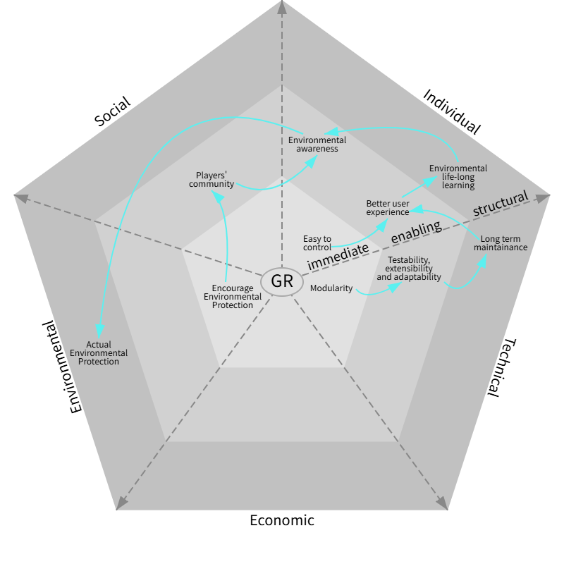
</p>

<p align="center">
The sustainability awareness diagram.
</p>

## Conclusion

We gained valuable experience developing our game, The Green Renaissance, as the first step towards engineering beyond mere coding. Complying with the Agile principles and applying the agile approaches, we learned how to collaborate as a team as well as manage and maintain our work. Among all Agile practices, we have made every effort to leverage the Scrum methodology in particular by utilising weekly sprints and retrospective meetings. The continuous integration and incremental deliveries as small successes have greatly bolstered our confidence during the whole development process. 

A significant lesson we learned was the power of requirements-driven development. By pre-defining requirements and product backlog, we have clear ideas of how the system will act and react, reducing potential unnecessary work. Well-defined requirements also make testing and validation handy by directly referring to the acceptance criteria. It is also rewarding to list all the requirements so we are able to order them by priority based on balancing value against effort.

Challenges exist alongside development. The major challenge we encountered from the early to the late stages is the maintenance, which we believe every team struggles with. We managed to resolve it by applying the RESTful layered modularisation, which greatly decoupled components through dependency injection. Also, the separation of concerns, namely, to dispatch responsibility to lower-level components as much as possible, proved to be extremely beneficial to building a reusable and self-documented codebase. Keeping a maintainable codebase is critical not only to testing and easier debugging, but also to long-term engineering. It would be much simpler to introduce new functionalities without breaking the existing system.

In addition to technical challenges, we also lost our way while designing the game elements. As the elements piled up, our initial brilliant ideas became exhausted, leaving us struggling. Eventually, we succeeded in designing through team discussions where members shared their thoughts, which were distilled to capture the essence and combined together.

We cherish user feedback since it validates our design and system functionalities. User feedback is vital to Agile development, and continuous feedback helps improve each iteration. By attending the CSS Testathon in addition to course workshops, we gathered feedback from various groups of people, uncovering usability issues which shaped other designs to be much more user-friendly.

There are also regrets that we could have done better. The most immediate enhancement is the full integration of gamepad support to offer a more accessible player experience, especially to those who are keen on controllers, or with disabilities, who find it difficult to use keyboard and mouse. We have partially fulfilled the key gamepad functionalities. Audio and ambient soundscapes are essential to an immersive game experience, but we have no time to integrate them. These possible future works would not only refine the existing gameplay but also broaden the game’s appeal to different types of players.


## Appendix


## Contribution Statement

| name          | contribution factor |
| ------------- | ------------------- |
| Chin Wei Liu  | 1                   |
| Xiaobai Zheng | 1                   |
| Fan Meng      | 1                   |
| Xiaoyu Wu     | 1                   |
| Rui Zhang     | 1                   |
| Zhenghao Yang | 1                   |
