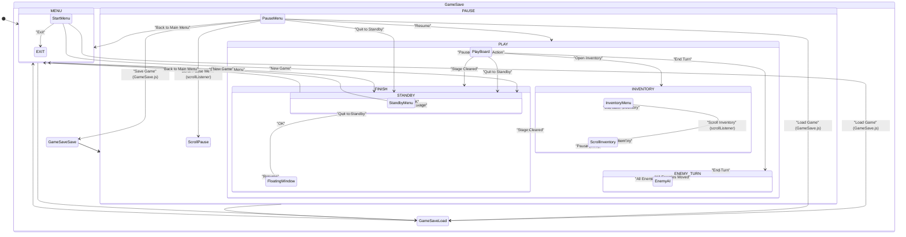

```mermaid
stateDiagram-v2
    [*] --> MENU

    state MENU {
        StartMenu --> STANDBY: "New Game"
        StartMenu --> GameSaveLoad: "Load Game" (GameSave.js)
        StartMenu --> EXIT: "Exit"
    }

    state STANDBY {
        StandbyMenu --> PLAY: "Select Stage"
        StandbyMenu --> MENU: "Back to Main Menu"
    }

    state PLAY {
        PlayBoard --> PLAY: "Player Action"
        PlayBoard --> ENEMY_TURN: "End Turn"
        PlayBoard --> PAUSE: "Pause (ESC)"
        PlayBoard --> STANDBY: "Quit to Standby"
        PlayBoard --> FINISH: "Stage Cleared"
        PlayBoard --> INVENTORY: "Open Inventory"
    }

    state INVENTORY {
        InventoryMenu --> PLAY: "Close Inventory"
        InventoryMenu --> PLAY: "Use Item"
        InventoryMenu --> ScrollInventory: "Scroll Inventory" (scrollListener)
    }

    state ENEMY_TURN {
        EnemyAI --> PLAY: "All Enemies Moved"
    }

    state PAUSE {
        PauseMenu --> PLAY: "Resume"
        PauseMenu --> STANDBY: "Quit to Standby"
        PauseMenu --> MENU: "Back to Main Menu"
        PauseMenu --> GameSaveLoad: "Load Game" (GameSave.js)
        PauseMenu --> GameSaveSave: "Save Game" (GameSave.js)
        PauseMenu --> ScrollPause: "Scroll Pause Menu" (scrollListener)
    }

    state FINISH {
        FloatingWindow --> STANDBY: "OK"
    }

    %% 主要狀態切換
    MENU --> STANDBY: "New Game"
    STANDBY --> PLAY: "Select Stage"
    PLAY --> ENEMY_TURN: "End Turn"
    ENEMY_TURN --> PLAY: "All Enemies Moved"
    PLAY --> PAUSE: "Pause (ESC)"
    PAUSE --> PLAY: "Resume"
    PLAY --> FINISH: "Stage Cleared"
    FINISH --> STANDBY: "OK"
    PLAY --> STANDBY: "Quit to Standby"
    STANDBY --> MENU: "Back to Main Menu"

    %% 存檔與讀取機制
    state GameSave {
        GameSaveLoad --> MENU
        GameSaveSave --> PAUSE
    }

    MENU --> GameSaveLoad
    PAUSE --> GameSaveLoad
    GameSaveSave --> PAUSE

    %% 物品管理系統
    PLAY --> INVENTORY: "Open Inventory"
    INVENTORY --> PLAY: "Close Inventory"
    INVENTORY --> PLAY: "Use Item"
    ScrollInventory --> INVENTORY

    %% Pause Menu 滾動支援
    ScrollPause --> PAUSE

```