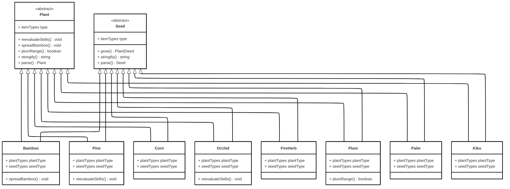

```mermaid
---
config:
  theme: neo
  layout: elk
  look: classic

---

classDiagram
direction TB
    class Plant {
	    + itemTypes type
	    + reevaluateSkills() void
	    + spreadBamboo() void
	    + plumRange() boolean
	    + stringify() string
	    + parse() Plant
    }
    class Bamboo {
	    + plantTypes plantType
	    + seedTypes seedType
	    + spreadBamboo() void
    }
    class Pine {
	    + plantTypes plantType
	    + seedTypes seedType
	    + reevaluateSkills() void
    }
    class Corn {
	    + plantTypes plantType
	    + seedTypes seedType
    }
    class Orchid {
	    + plantTypes plantType
	    + seedTypes seedType
	    + reevaluateSkills() void
    }
    class FireHerb {
	    + plantTypes plantType
	    + seedTypes seedType
    }
    class Plum {
	    + plantTypes plantType
	    + seedTypes seedType
	    + plumRange() boolean
    }
    class Palm {
	    + plantTypes plantType
	    + seedTypes seedType
    }
    class Kiku {
	    + plantTypes plantType
	    + seedTypes seedType
    }
    class Seed {
	    + itemTypes type
	    + grow() Plant|Seed
	    + stringify() string
	    + parse() Seed
    }
	<<abstract>> Plant
	<<abstract>> Seed
    Plant <|-- Bamboo
    Plant <|-- Pine
    Plant <|-- Corn
    Plant <|-- Orchid
    Plant <|-- FireHerb
    Plant <|-- Plum
    Plant <|-- Palm
    Plant <|-- Kiku
    Seed <|-- Bamboo
    Seed <|-- Pine
    Seed <|-- Corn
    Seed <|-- Orchid
    Seed <|-- FireHerb
    Seed <|-- Plum
    Seed <|-- Palm
    Seed <|-- Kiku
```