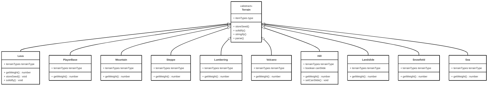

```mermaid
---
config:
  theme: neo
  layout: dagre
  look: classic
---
classDiagram
direction TB
    class Terrain {
	    + itemTypes type
	    + storeSeed()
	    + solidify()
	    + stringify()
	    + parse()
    }
    class Lava {
	    + terrainTypes terrainType
      + getWeight() number
	    + storeSeed() void
	    + solidify() void
    }
    class PlayerBase {
	    + terrainTypes terrainType
      + getWeight() number
    }
    class Mountain {
	    + terrainTypes terrainType
      + getWeight() number
    }
    class Steppe {
	    + terrainTypes terrainType
      + getWeight() number
    }
    class Lumbering {
	    + terrainTypes terrainType
      + getWeight() number
    }
    class Volcano {
	    + terrainTypes terrainType
      + getWeight() number
    }
    class Hill {
	    + terrainTypes terrainType
      + boolean canSlide
      + getWeight() number
      + setCanSlide() void
    }
    class Landslide {
	    + terrainTypes terrainType
      + getWeight() number
    }
    class Snowfield {
	    + terrainTypes terrainType
      + getWeight() number
    }
    class Sea {
	    + terrainTypes terrainType
      + getWeight() number
    }
	<<abstract>> Terrain
    Terrain <|-- Lava
    Terrain <|-- PlayerBase
    Terrain <|-- Mountain
    Terrain <|-- Steppe
    Terrain <|-- Lumbering
    Terrain <|-- Volcano
    Terrain <|-- Hill
    Terrain <|-- Landslide
    Terrain <|-- Snowfield
    Terrain <|-- Sea
```