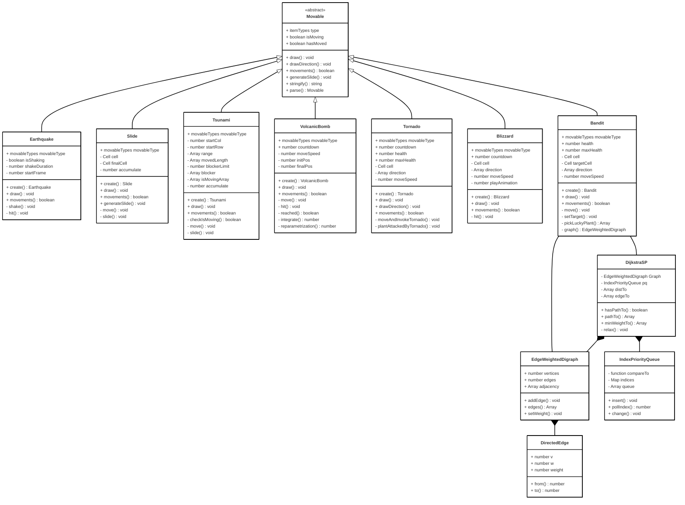

```mermaid
---
config:
  theme: neo
  layout: dagre
  look: classic
---
classDiagram
direction TB
    class Movable {
	    + itemTypes type
        + boolean isMoving
        + boolean hasMoved
        + draw() void
        + drawDirection() void
	    + movements() boolean
	    + generateSlide() void
	    + stringify() string
	    + parse() Movable
    }
    class Earthquake {
	    + movableTypes movableType
        - boolean isShaking
        - number shakeDuration
        - number startFrame
        + create() Earthquake
	    + draw() void
	    + movements() boolean
        - shake() void
        - hit() void
    }
    class Slide {
	   + movableTypes movableType
        - Cell cell
        - Cell finalCell
        - number accumulate
        + create() Slide
	    + draw() void
	    + movements() boolean
        + generateSlide() void
        - move() void
        - slide() void
    }
    class Tsunami {
	    + movableTypes movableType
        - number startCol
        - number startRow
        - Array range
        - Array movedLength
        - number blockerLimit
        - Array blocker
        - Array isMovingArray
        - number accumulate
        + create() Tsunami
	    + draw() void
	    + movements() boolean
        - checkIsMoving() boolean
        - move() void
        - slide() void
    }
    class VolcanicBomb {
	    + movableTypes movableType
        + number countdown
        - number moveSpeed
        - number initPos
        - number finalPos
        + create() VolcanicBomb
	    + draw() void
	    + movements() boolean
        - move() void
        - hit() void
        - reached() boolean
        - integrate() number
        - reparametrization() number
    }
    class Tornado {
	    + movableTypes movableType
        + number countdown
        + number health
        + number maxHealth
        - Cell cell
        - Array direction
        - number moveSpeed
        + create() Tornado
	    + draw() void
        + drawDirection() void
	    + movements() boolean
        - moveAndInvokeTornado() void
	- plantAttackedByTornado() void
    }
    class Blizzard {
	   + movableTypes movableType
        + number countdown
        - Cell cell
        - Array direction
        - number moveSpeed
        - number playAnimation
        + create() Blizzard
	    + draw() void
	    + movements() boolean
        - hit() void
    }
    class Bandit {
	    + movableTypes movableType
        + number health
        + number maxHealth
        - Cell cell
        - Cell targetCell
        - Array direction
        - number moveSpeed
        + create() Bandit
	    + draw() void
	    + movements() boolean
        - move() void
        - setTarget() void
        - pickLuckyPlant() Array
        - graph() EdgeWeightedDigraph
    }

    class EdgeWeightedDigraph{
        + number vertices
        + number edges
        + Array adjacency
        + addEdge() void
        + edges() Array
        + setWeight() void
    }

    class DirectedEdge {
        + number v
        + number w
        + number weight
        + from() number
        + to() number
    }

    class DijkstraSP{
        - EdgeWeightedDigraph Graph
        - IndexPriorityQueue pq
        - Array distTo
        - Array edgeTo
        + hasPathTo() boolean 
        + pathTo() Array 
        + minWeightTo() Array
        - relax() void
    }

	
    class IndexPriorityQueue{
        - function compareTo
        - Map indices
        - Array queue
        + insert() void
        + pollIndex() number
        + change() void
    }

	<<abstract>> Movable
    Movable <|-- Earthquake
    Movable <|-- Slide
    Movable <|-- Tsunami
    Movable <|-- VolcanicBomb
    Movable <|-- Tornado
    Movable <|-- Blizzard
    Movable <|-- Bandit
    Bandit -- DijkstraSP
    Bandit -- EdgeWeightedDigraph
    DijkstraSP *-- EdgeWeightedDigraph
    DijkstraSP *-- IndexPriorityQueue
    EdgeWeightedDigraph *-- DirectedEdge
```