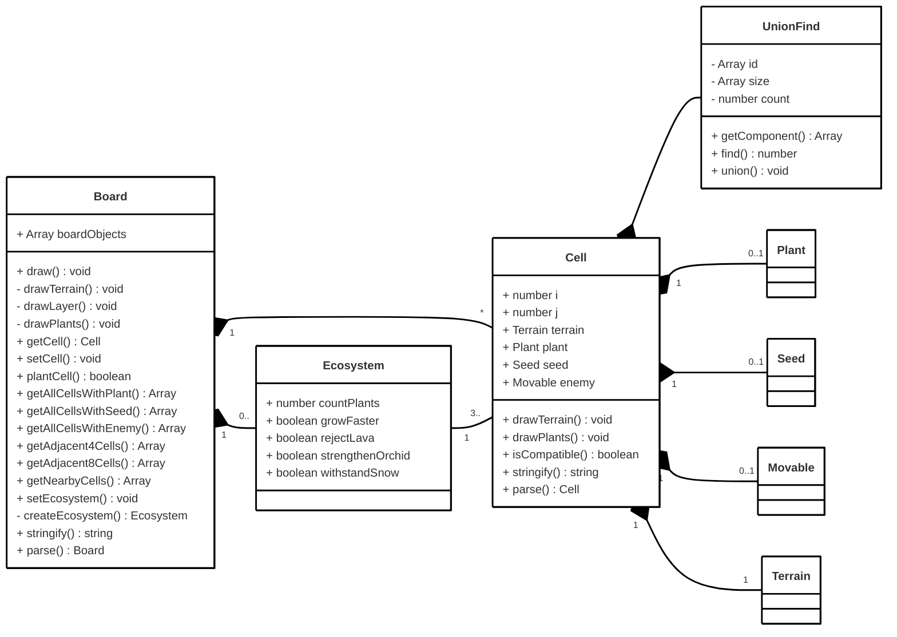

```mermaid
---
config:
  theme: neo
  layout: dagre
  look: classic
---
classDiagram
direction LR
    class Board {
	    + Array boardObjects
        + draw() void
        - drawTerrain() void
        - drawLayer() void
        - drawPlants() void
        + getCell() Cell
        + setCell() void
        + plantCell() boolean
        + getAllCellsWithPlant() Array
        + getAllCellsWithSeed() Array
        + getAllCellsWithEnemy() Array
        + getAdjacent4Cells() Array
        + getAdjacent8Cells() Array
        + getNearbyCells() Array
        + setEcosystem() void
        - createEcosystem() Ecosystem
        + stringify() string
        + parse() Board
    }

    class Cell{
        + number i
        + number j
        + Terrain terrain
        + Plant plant
        + Seed seed
        + Movable enemy
        + drawTerrain() void
        + drawPlants() void
        + isCompatible() boolean
        + stringify() string
        + parse() Cell
    }

    class Ecosystem{
        + number countPlants
        + boolean growFaster
        + boolean rejectLava
        + boolean strengthenOrchid
        + boolean withstandSnow
    }

    class UnionFind{
        - Array id
        - Array size
        - number count
        + getComponent() Array
        + find() number
        + union() void
    }

    Board "1" *-- "*" Cell
    Cell *-- UnionFind
    Ecosystem "1" -- "3.." Cell
    Board "1" *-- "0.." Ecosystem
    Cell "1" *-- "0..1" Plant
    Cell "1" *-- "0..1" Seed
    Cell "1" *-- "0..1" Movable
    Cell "1" *-- "1" Terrain
```