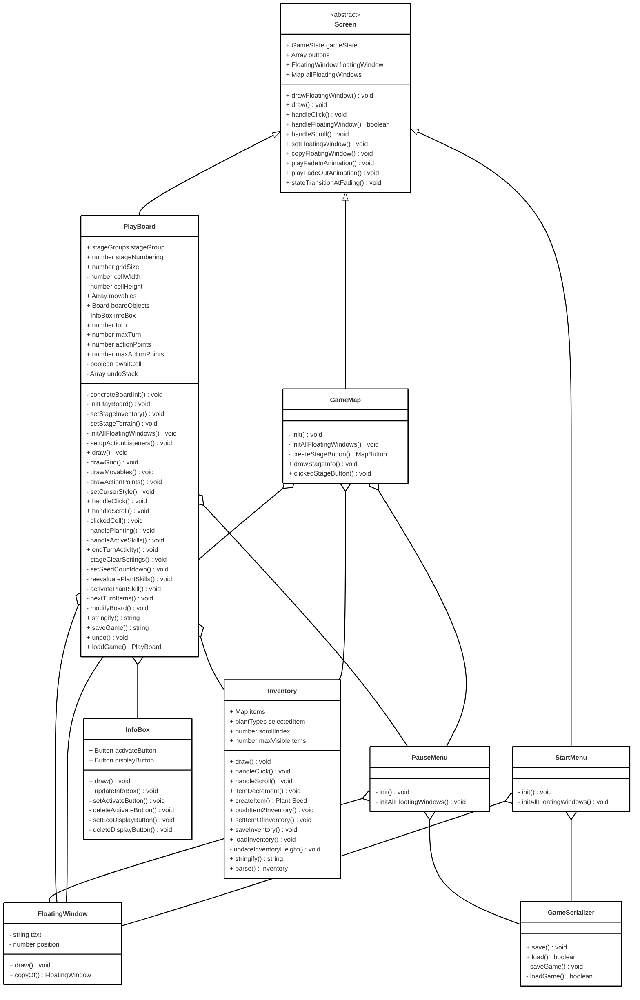

```mermaid
---
config:
  theme: neo
  layout: dagre
  look: classic
---
classDiagram
direction TB
    class Screen {
        + GameState gameState
        + Array buttons
        + FloatingWindow floatingWindow
        + Map allFloatingWindows
        + drawFloatingWindow() void
        + draw() void
        + handleClick() void
        + handleFloatingWindow() boolean
        + handleScroll() void
        + setFloatingWindow() void
        + copyFloatingWindow() void
        + playFadeInAnimation() void
        + playFadeOutAnimation() void
        + stateTransitionAtFading() void
    }

    class FloatingWindow{
        - string text
        - number position
        + draw() void
        + copyOf() FloatingWindow
    }

    class StartMenu{
        - init() void
        - initAllFloatingWindows() void
    }

    class PauseMenu{
        - init() void
        - initAllFloatingWindows() void
    }

    class GameMap{
        - init() void
        - initAllFloatingWindows() void
        - createStageButton() MapButton
        + drawStageInfo() void
        + clickedStageButton() void
    }

    class PlayBoard{
        + stageGroups stageGroup
        + number stageNumbering
        + number gridSize
        - number cellWidth
        - number cellHeight
        + Array movables
        + Board boardObjects
        - InfoBox infoBox
        + number turn
        + number maxTurn
        + number actionPoints
        + number maxActionPoints
        - boolean awaitCell
        - Array undoStack
        - concreteBoardInit() void
        - initPlayBoard() void
        - setStageInventory() void
        - setStageTerrain() void
        - initAllFloatingWindows() void
        - setupActionListeners() void
        + draw() void
        - drawGrid() void
        - drawMovables() void
        - drawActionPoints() void
        - setCursorStyle() void
        + handleClick() void
        + handleScroll() void
        - clickedCell() void
        - handlePlanting() void
        - handleActiveSkills() void
        + endTurnActivity() void
        - stageClearSettings() void
        - setSeedCountdown() void
        - reevaluatePlantSkills() void
        - activatePlantSkill() void
        - nextTurnItems() void
        - modifyBoard() void
        + stringify() string
        + saveGame() string
        + undo() void
        + loadGame() PlayBoard
    }

    class InfoBox{
        + Button activateButton
        + Button displayButton
        + draw() void
        + updateInfoBox() void
        - setActivateButton() void
        - deleteActivateButton() void
        - setEcoDisplayButton() void
        - deleteDisplayButton() void
    }

    class Inventory{
        + Map items
        + plantTypes selectedItem
        + number scrollIndex
        + number maxVisibleItems
        + draw() void
        + handleClick() void
        + handleScroll() void
        + itemDecrement() void
        + createItem() Plant|Seed
        + pushItem2Inventory() void
        + setItemOfInventory() void
        + saveInventory() void
        + loadInventory() void
        - updateInventoryHeight() void
        + stringify() string
        + parse() Inventory
    }

    class GameSerializer{
        + save() void
        + load() boolean
        - saveGame() void
        - loadGame() boolean
    }

    <<abstract>> Screen

Screen <|-- StartMenu
Screen <|-- GameMap
Screen <|-- PlayBoard
GameMap o-- PauseMenu
PlayBoard o-- PauseMenu
StartMenu o-- FloatingWindow
GameMap o-- FloatingWindow
PlayBoard o-- FloatingWindow
PauseMenu o-- FloatingWindow
PlayBoard o-- InfoBox
GameMap o-- Inventory
PlayBoard o-- Inventory
StartMenu o-- GameSerializer
PauseMenu o-- GameSerializer
```