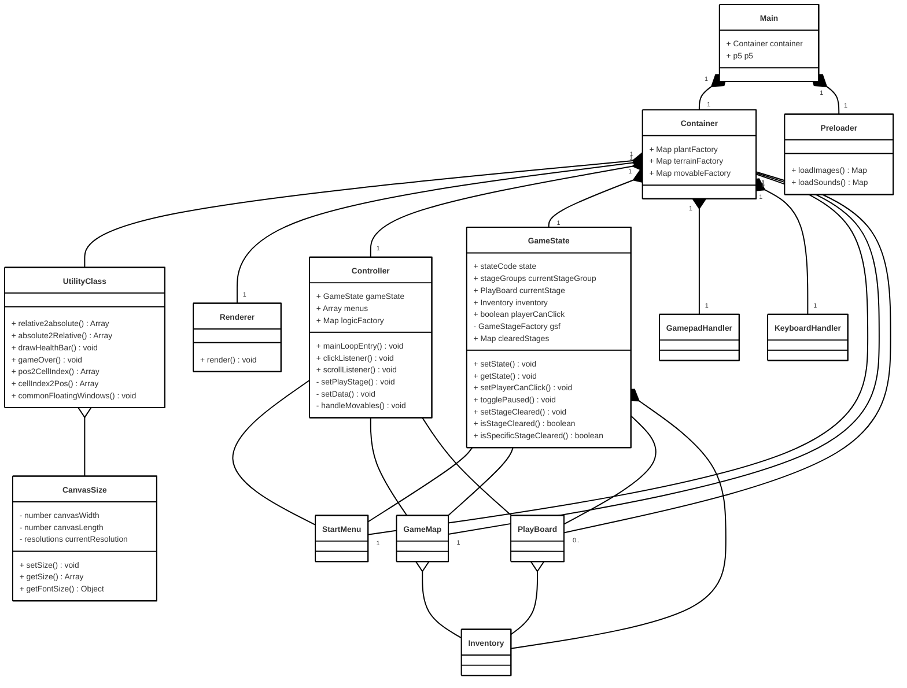

```mermaid
---
config:
  theme: neo
  layout: dagre
  look: classic
---
classDiagram
direction TB
    class Container{
        + Map plantFactory
        + Map terrainFactory
        + Map movableFactory
    }

    class Inventory{

    }

    class GameState{
        + stateCode state
        + stageGroups currentStageGroup
        + PlayBoard currentStage
        + Inventory inventory
        + boolean playerCanClick
        - GameStageFactory gsf
        + Map clearedStages
        + setState() void
        + getState() void
        + setPlayerCanClick() void
        + togglePaused() void
        + setStageCleared() void
        + isStageCleared() boolean
        + isSpecificStageCleared() boolean
    }

    class StartMenu{

    }

    class GameMap{

    }

    class PlayBoard{

    }

    class Controller{
        + GameState gameState
        + Array menus
        + Map logicFactory
        + mainLoopEntry() void
        + clickListener() void
        + scrollListener() void
        - setPlayStage() void
        - setData() void
        - handleMovables() void
    }

    class Renderer{
        + render() void
    }

    class KeyboardHandler{

    }

    class GamepadHandler{
        
    }

    class CanvasSize{
        - number canvasWidth
        - number canvasLength
        - resolutions currentResolution
        + setSize() void
        + getSize() Array
        + getFontSize() Object
    }

    class Main{
        + Container container
        + p5 p5
    }

    class Preloader{
        + loadImages() Map
        + loadSounds() Map
    }

    class UtilityClass{
        + relative2absolute() Array
        + absolute2Relative() Array
        + drawHealthBar() void
        + gameOver() void
        + pos2CellIndex() Array
        + cellIndex2Pos() Array
        + commonFloatingWindows() void
    }

Main "1" *-- "1" Container
Main "1" *-- "1" Preloader
UtilityClass o-- CanvasSize
Container *-- UtilityClass
Container "1" *-- "1" Renderer
Container "1" *-- "1" Controller
Container "1" *-- "1" GameState
Container "1" *-- "1" GamepadHandler
Container "1" *-- "1" KeyboardHandler
GameState  -- StartMenu
GameState  -- GameMap
GameState  -- PlayBoard
Container "1" -- "1" StartMenu
Container "1" -- "1" GameMap
Container "1" -- "0.." PlayBoard
Controller -- StartMenu
Controller -- GameMap
Controller -- PlayBoard
PlayBoard o-- Inventory
GameMap o-- Inventory
GameState *-- Inventory
```