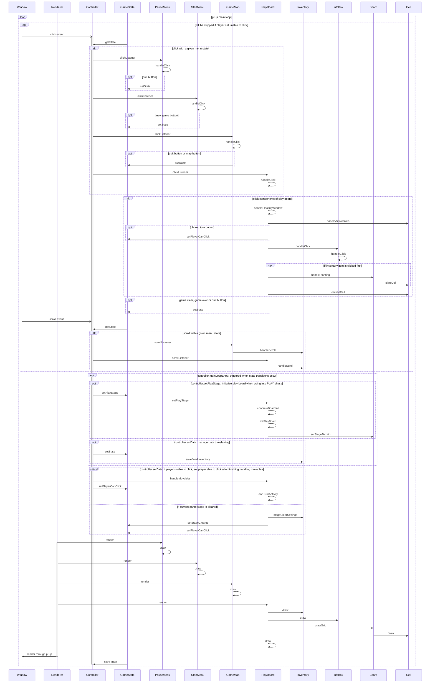

```mermaid
sequenceDiagram
  participant Window as Window
  participant Renderer as Renderer
  participant Controller as Controller
  participant GameState as GameState
  participant PauseMenu as PauseMenu
  participant StartMenu as StartMenu
  participant GameMap as GameMap
  participant PlayBoard as PlayBoard
  participant Inventory as Inventory
  participant InfoBox as InfoBox
  participant Board as Board
  participant Cell as Cell

  loop p5.js main loop
  opt will be skipped if player set unable to click
    Window -) Controller: click event
    activate Controller
    GameState ->> Controller: getState
    alt click with a given menu state
      Controller ->> PauseMenu: clickListener
      PauseMenu ->> PauseMenu: handleClick
      opt quit button
        PauseMenu ->> GameState: setState
      end
      Controller ->> StartMenu: clickListener
      StartMenu ->> StartMenu: handleClick
      opt new game button
        StartMenu ->> GameState: setState
      end
      Controller ->> GameMap: clickListener
      GameMap ->> GameMap: handleClick
      opt quit button or map button
        GameMap ->> GameState: setState
      end
      Controller ->> PlayBoard: clickListener
      PlayBoard ->> PlayBoard: handleClick
    end
    alt click components of play board
        PlayBoard ->> PlayBoard: handleFloatingWindow
        PlayBoard ->> Cell: handleActiveSkills
        opt clicked turn button
            PlayBoard ->> GameState: setPlayerCanClick
        end
        PlayBoard ->> InfoBox: handleClick
        InfoBox ->> InfoBox: handleClick
        opt if inventory item is clicked first
            PlayBoard ->> Board: handlePlanting
            Board ->> Cell: plantCell
        end
        PlayBoard ->> Cell: clickedCell
    end
    opt game clear, game over or quit button
        PlayBoard ->> GameState: setState
    end
    Window -) Controller: scroll event
    GameState ->> Controller: getState
    alt scroll with a given menu state
      Controller ->> GameMap: scrollListener
      GameMap ->> Inventory: handleScroll
      Controller ->> PlayBoard: scrollListener
      PlayBoard ->> Inventory: handleScroll
    end
    end

    opt controller.mainLoopEntry: triggered when state transitions occur
        opt controller.setPlayStage: initialize play board when going into PLAY phase
            Controller ->> GameState: setPlayStage
            Controller ->> PlayBoard: setPlayStage
            PlayBoard ->> PlayBoard: concreteBoardInit
            PlayBoard ->> PlayBoard: initPlayBoard
            PlayBoard ->> Board: setStageTerrain
        end
        opt controller.setData: manage data transferring
            Controller ->> GameState: setState
            
            Controller ->> Inventory: save/load inventory
        end
    end
    critical controller.setData:  if player unable to click, set player able to click after finishing handling movables 
        Controller ->> PlayBoard: handleMovables
        Controller ->> GameState: setPlayerCanClick
        PlayBoard ->> PlayBoard: endTurnActivity
        option if current game stage is cleared
            PlayBoard ->> Inventory: stageClearSettings
            PlayBoard ->> GameState: setStageCleared
            PlayBoard ->> GameState: setPlayerCanClick
        
    end
    Renderer ->> PauseMenu: render
    activate Renderer
    PauseMenu->> PauseMenu: draw
      Renderer ->> StartMenu: render
      StartMenu->>StartMenu: draw
      Renderer ->> GameMap: render
      GameMap->>GameMap: draw
      Renderer ->> PlayBoard: render
      PlayBoard ->> Inventory: draw
      PlayBoard ->> InfoBox: draw
      PlayBoard ->> Board: drawGrid
      Board ->> Cell: draw
      PlayBoard->>PlayBoard:draw
    Renderer ->> Window: render through p5.js
    deactivate Renderer
    GameState ->> Controller: save state
    deactivate Controller
  end
```