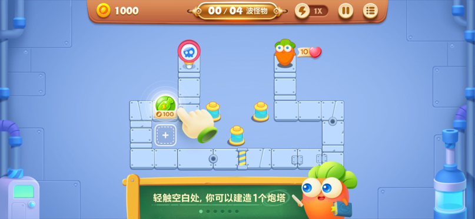
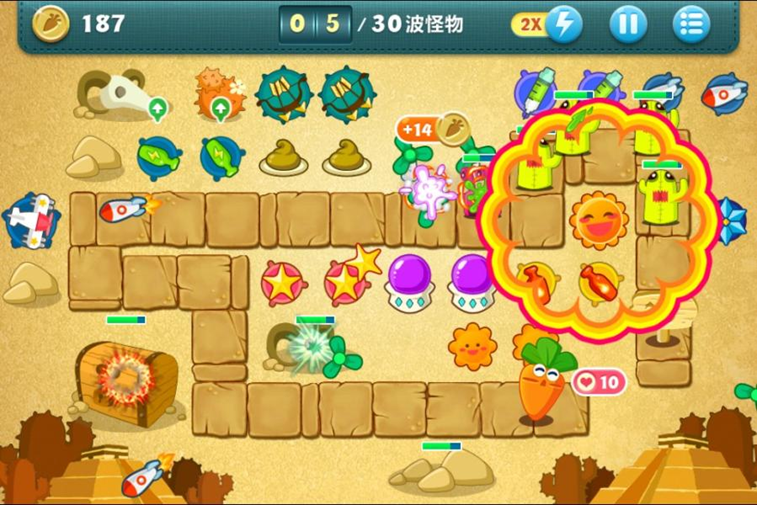
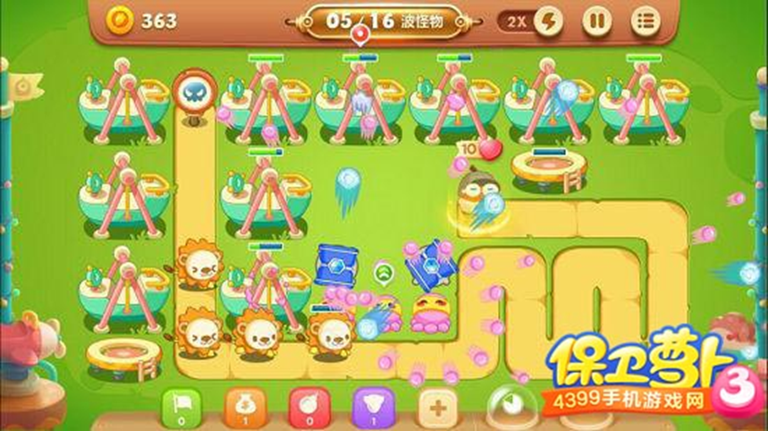

GAME ONE : Protect the Carrot

I. game rules
Basic Rules: Players need to build defense towers to protect the carrot and prevent monsters from reaching the end point from the starting point. The defense towers attack the monsters on the path, gradually reducing their health points. After the monsters are eliminated, players can obtain gold coins, which are used to build or upgrade defense towers.
Victory Condition: All monsters are eliminated and the carrot is still alive (with ten health points).
Defeat Condition: The monsters reach the carrot and the carrot's health points are depleted.

II. Architecture Analysis
Map Module: Contains information about the paths where monsters walk. Provides obstacles and tower building locations according to the level design. Attacking obstacles with turrets can obtain gold coins.
Monster Module: Different types of monsters have different speeds, health points, and resistances.
Defense Tower Module: There are multiple types of towers (such as slowdown towers, area attack towers, single high-damage towers). Towers can be upgraded to increase attack power or range.
Resource System: Players obtain gold coins by defeating monsters, and the gold coins are used to build and upgrade towers.
Level Logic: Each level has different waves of monsters, gradually increasing the difficulty.

Stage 1: Preparation stage. Players choose the placement positions of towers and formulate strategies.
Stage 2: Battle stage. Monsters are generated in waves and towers automatically attack monsters.
Stage 3: Settlement stage. After the player wins or loses, the score and rewards are counted, and the player proceeds to the next level or restarts the challenge.
Technical Implementation
Map: Implemented based on a two-dimensional grid, including tower building locations and path planning.
Monster Path: Monsters move along the preset path.
Defense Tower Attack: Calculate the collision detection of monsters within the range and reduce the health points of monsters.

II. Architecture Analysis / Game Characters
Defense Towers: There are many types of defense towers in the game, such as the attacking bottle tower, magic ball tower, the area damage fan tower, rocket tower, the control type ice star, slowdown gear, etc. Each type of defense tower has a unique appearance, attack method, and upgrade effect. Players need to select and combine them according to different monsters and scene requirements.
Monsters: There are a rich variety of monster types, including small minions with fast speed but low health points, large monsters with high health points but slow movement, as well as flying monsters with special skills, self-destructing monsters, etc.
Obstacles: Each level map will have different obstacles, such as stones, trees, boxes, etc. Each obstacle has different health points (the time required to eliminate the obstacle by attacking). Eliminating obstacles will yield corresponding gold coins or item rewards.
Other Characters: The carrot is the target that players need to protect. The carrot has different skins and shapes.

II. Architecture Analysis / Turret
[Here are some links about turret introductions in the game Protect the Carrot 3]
https://news.4399.com/bwlb3/paota/

III. Innovation Points
Monster movement posture animation simulation, turret attack process simulation, monster being attacked and losing health simulation, etc.
Graphics: Each level map has a unique theme and style, such as forest, desert, ocean, etc.
Sound Effects: Defense towers' attacks, monsters' being injured and dying have corresponding sound effects. At the same time, different scenes are accompanied by different background music.
Level System: There are a large number of levels with gradually increasing difficulty. Each level has different terrains, monster combinations, and mission objectives, such as protecting a certain number of carrots, eliminating all monsters within a specified time, etc.
Item System: Various items can be collected and used in the game, such as bombs, slowdown potions, etc. Items can also be purchased with in-game currency.
Development System: Gold coins can be used to upgrade defense towers to improve their attack power, range, attack speed and other attributes.
Strategy: Players need to reasonably plan the placement positions of different types of defense towers according to the map terrain and monster movement paths. At the same time, they need to reasonably allocate resources to build and upgrade defense towers.

---------------------------------------------------------------------------------------------
Technical realization possibility analysis

First, basic Settings
Introduce the p5.js library: Introduce the p5.js library through the <script> tag in HTML files to ensure that you can use the drawing and interaction features it provides.
Create canvas: Use the createCanvas() function to create the canvas of the game and determine the size of the game screen.
2. Creation and management of game objects
The use of Sprites:
Create sprites: Use the createSprite() function to create various elements in the game, such as characters, items, etc.
Set Sprite properties: including location, size, image, etc. For example, sprite.position(x, y) is used to set the position, and sprite.size(width, height) is used to adjust the size.
sprite movement, rotation and scaling control: Change the x and y coordinates of sprites to move, using sprite.velocity(dx, dy) to set the velocity vector; Rotate by sprite.rotation(radians) and scale by sprite.scale(x, y).
Group management of sprites: Group sprites with similar functions or behaviors to facilitate batch control and collision detection.
Cascade and visibility control: Control the stack order of sprites on the screen by setting the sprite's z property or using the Sprite.layer method.
3. Animation production
Design animation frames and keyframes: Determine the key frames needed in the game and create a corresponding frame image for each Sprite.
The createImage and image functions are used to design and display frames.
4. Integration and use of physical engine
Install and configure physical engines such as the pyshics engine.
Create a physical world: Create a physical world with a specific gravity in a way similar to new pyshics.World(0, -9.81).
Add physical attributes to the object: for example, set the quality of the Sprite, speed, etc.
Collision detection and response: Handles collisions between sprites and other objects.
5. User interaction
Monitor user input events such as mouse clicks and keyboard keys.
Control the behavior of game objects based on user input, such as the movement of characters, actions, etc.
Six, the realization of game logic
Design the rules and processes of the game, such as the scoring system, game end conditions, etc.
Handle various state changes in the game, such as character health, item acquisition and use.
Seven, the game cycle update
The draw() function constantly updates the game state to achieve the dynamic effect of the game.
8. Other aspects
Optimize your code to improve your game's performance and fluency.
To handle possible errors and exceptions, debug using console.log().
Design the right interface and sound to enhance the user experience of your game.

-----------------------------------------------------------------------------------------------------------------------

GAME 2
 hero goes down a hundred floors
https://haiyong.site/moyu/100/#google_vignette
<!---Missing files-->
<!---)-->

<!----->

I. Overview of the game
"Is the hero on the next 100 layers" is a vertical fall as the core of the casual game. The player controls the character from the top of the screen, constantly moving down, avoiding various obstacles on the way, successfully through the floor to reach the 100th floor to win

II. core mechanism
Character movement: The player controls the character's left and right movement mainly through gravity sensing or screen swiping. In gravity sensing mode, the keyboard/mouse determines the direction of movement of the character (left and right), ensuring that the character can flexibly avoid obstacles and accurately land in a safe area.
Floor generation: The game uses a random algorithm to generate floor layouts. The width and spacing of the platform, as well as the location and type of obstacles, vary from level to level. For example, some floors may have narrow platforms or successive combinations of obstacles that require the player to react quickly.
Collision detection: An accurate collision detection system is key to the game. When the character collides with an obstacle or the edge of a floor, the game determines that the player has failed and triggers the corresponding failure screen and sound effects. The system monitors the relationship between the character's position and the surrounding environment in real time to ensure the accuracy of the game results.

III. Picture and sound design
Picture style: 2D pixel style or simple cartoon style
Sound collocation: The falling process accompanied by continuous wind or slight background music. Jumping, colliding, collecting items and other operations have corresponding sound effects
Speed increase: As the game progresses, the character falls faster and faster.
Obstacle complexity increases: the number of obstacles in the floor not only increases, but also its distribution and appearance law is more complex. For example, there may be a single stationary obstacle in the beginning, and a moving obstacle, a combination of obstacles, and a sudden appearance of traps in the later stage.
