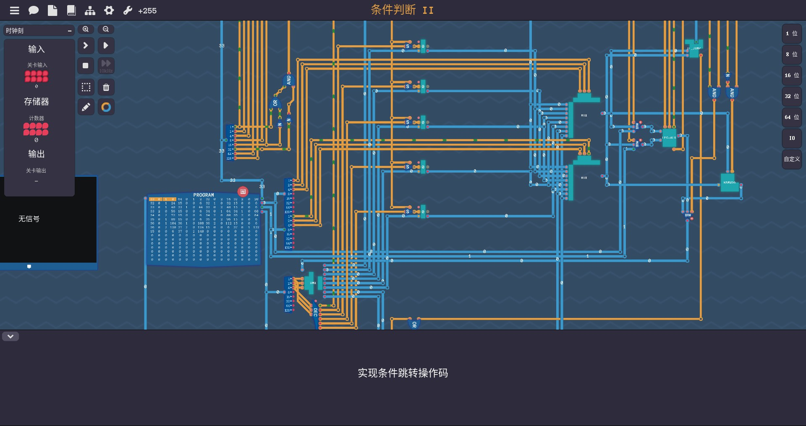
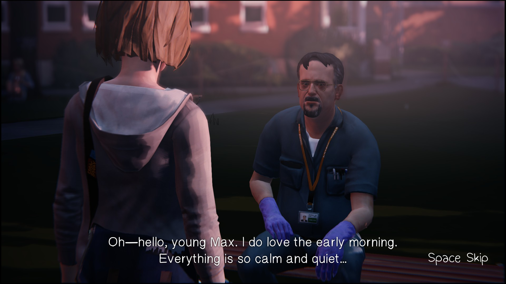

## Mahjong Soul - 雀魂

麻将模拟器. 融合了二次元文化, 更面向年轻人. 比起古早的老麻将游戏, UI更现代.

挑战:

1. UI设计.
2. 为了使单人游戏成为可能, 如何编写电脑玩家的打牌逻辑.

可能的拓展: 添加一些奇怪的作弊技能, 比如可以看穿别人的手牌. 

## Atelier Series - 炼金工房

在地图中与魔物作战, 收集各种素材, 炼金得到更强的装备和道具.

挑战:

1. 需要3D场景.
2. 需要大量美术素材.

## Danganronpa - 弹丸论破

文字冒险+3D解谜探案. 文字故事起到推动剧情前进\铺垫案件背景的作用. 案件发生后, 玩家会在地图中自由收集证据, 所有证据会被加入玩家的证言库, 收集结束后会展开"学级审判", 玩家与NPC将通过会议的形式讨论出谁是凶手.

挑战:

1. 推理游戏的最难点: 编一个好故事.
2. 需要3D场景.

## Ace Attorney - 逆转裁判

文字冒险+2D解谜探案. 最难点依然是写一个好的故事.

## Return of the Obra Dinn - 奥伯拉丁的回归

3D解谜探案. 游戏不是线性叙述的故事, 而是将一个故事拆成片段, 通过一块能回溯时间的表来让主角返回NPC死前的画面, 从而补全故事. 硬核推理.

挑战: 同上.

## Victoria - 维多利亚

模拟19世纪的全球市场. 玩家将扮演一个国家, 通过经济战或者战争来让自己的国家成为世界霸权.

挑战: 

1. 实现复杂的经济系统. p5js不适合用于这类大型计算.
2. 画一副带格子的世界地图 - 非常枯燥耗时.

我电脑已经跑不动这游戏了,  所以没有截图

## Stardew Valley - 星露谷物语

种地, 钓鱼, 挖矿. 轻松休闲的游戏.

挑战: 

1. UI及美工.

## Papers, Please - 请出示证件

玩家扮演一个边境审查官, 核查入境者的护照等证件. 背景是类似1984的架空冷战世界. 政治背景加一点展现普通人的抗争的感人小故事.

挑战:

1. UI及美工

## Turing Complete - 图灵完备

Logisim闯关版. 从NAND门出发拼一台计算机. 计算机原理由浅入深, 循序渐进.

挑战:

1. 实现各个组件的功能, 等于写了一个Logisim.

## Life is Strange - 奇异人生

文字冒险. 通过不同对话分支导向不同的结局. 只要故事有趣就会好玩.

## The Bridge

2D解谜闯关. 通过一些物理机制来设置谜题.

挑战:

1. 写一个物理引擎.
2. 编一些有趣的关卡.

