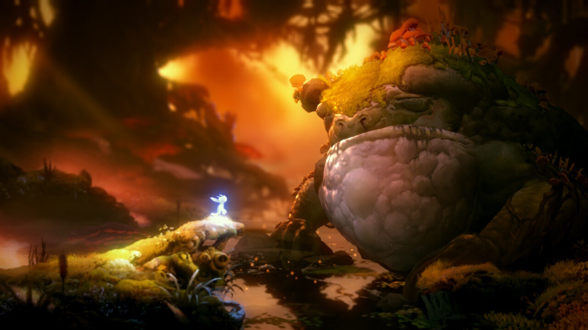
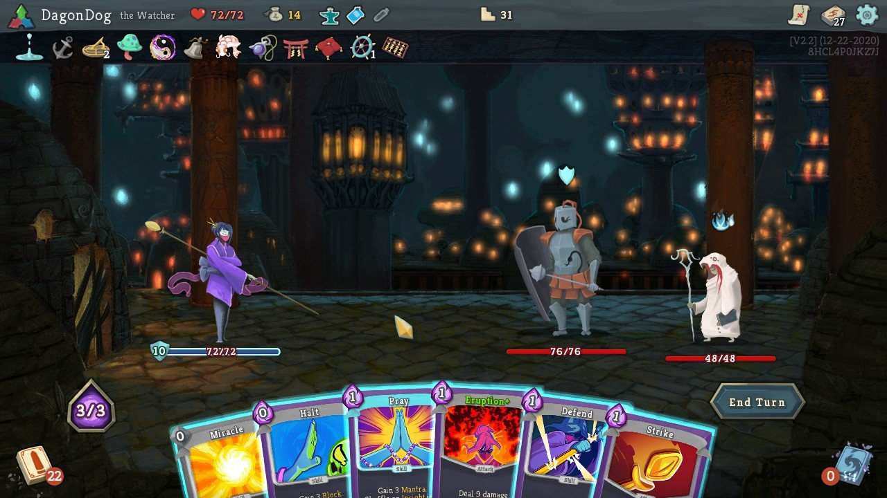
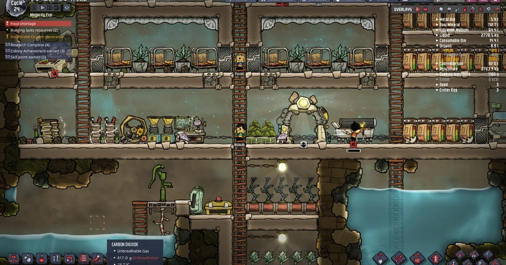

## 1.Make it work, then make it better

## 2.Focus on one main game design

## 3.Replicate a game or make a new one?

​	Not entirely new though, have to use a game as module

## 4.The difficulty different types of game

​	The following types are just used to differ the difficulties

​	Action: action design, physical simulation

​	Story: script writing

​	Strategy, simulation: game play design

## 5.Examples:

​	Ori and the Will of the wisps(Action)

​	Slay the spire(strategy, card game)

​	Oxygen not included(simulation)

