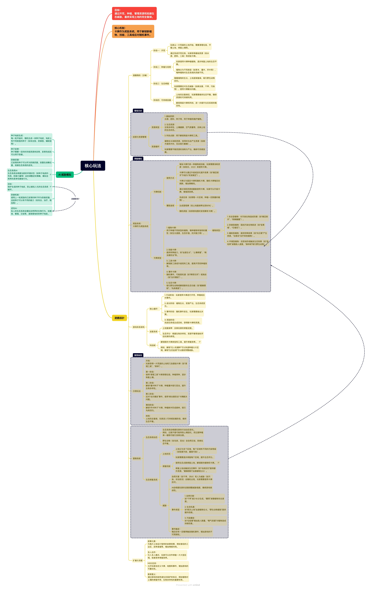

# 核心玩法

- **目标**：通过开荒、种植、管理资源和抵御生态威胁，最终实现土地的完全复绿。
- **核心机制**：卡牌作为奖励系统，用于解锁新植物、技能、工具或应对随机事件。

##  阶段

- **阶段一：开荒**
  - 玩家从一片荒废的土地开始，需要清理垃圾、平整土地、修复土壤等。
  - 通过完成开荒任务，玩家获得基础资源（如水源、肥料、工具）和初始卡牌。
- **阶段二：种植与培育**
  - 玩家使用卡牌种植植物，逐步恢复土地的生态平衡。
  - 植物分为不同类型（如草本、灌木、乔木等），每种植物对生态系统的贡献不同。
- **阶段三：生态修复**
  - 随着植物的生长，土地逐渐复绿，吸引野生动物回归。
  - 玩家需要应对生态威胁（如病虫害、干旱、污染等），使用卡牌解决问题。
- **阶段四：可持续发展**
  - 土地完全复绿后，玩家需要维持生态平衡，确保资源的可持续利用。
  - 解锁高级卡牌和科技，进一步提升生态系统的稳定性。

### **卡牌作为奖励系统**

- **卡牌类型**：

  1. **植物卡牌**：用于种植不同类型的植物，每种植物有独特的属性（如生长速度、生态价值、抗灾能力等）。

     - #### **1. 植物与卡牌系统**

       - **植物类型**：
         1. **攻击型植物**：对污染生物造成伤害（如“豌豆射手”、“荆棘藤蔓”）。
         2. **防御型植物**：阻挡污染生物前进（如“坚果墙”、“石墙花”）。
         3. **辅助型植物**：提供特殊效果（如“向日葵”产生资源，“治愈花”治疗其他植物）。
         4. **环境型植物**：改变地形或触发生态效果（如“湿地草”减慢敌人速度，“森林树”吸引野生动物）。
       - **卡牌机制**：
         - 每张卡牌代表一种植物或技能，玩家需要消耗资源（如阳光、水分）来使用卡牌。
         - 卡牌可以通过升级或进化提升效果（如“豌豆射手”升级为“双发豌豆”）。
         - 卡牌分为固定卡牌和随机卡牌，随机卡牌每回合刷新，增加策略性。

  2. **技能卡牌**：提供特殊能力，如“加速生长”、“土壤修复”、“病虫害防治”等。

  3. **工具卡牌**：解锁新工具或升级现有工具，提高开荒和种植效率。

  4. **事件卡牌**：随机事件，可能是机遇（如“降雨充沛”）或挑战（如“虫灾爆发”）。

  5. **生态卡牌**：吸引野生动物或解锁新的生态功能（如“蜜蜂授粉”、“鸟类栖息”）。

- **卡牌获取**：

  - 完成任务（如清理一片区域、种植一定数量的植物）。
  - 达成里程碑（如土地复绿率达到50%）。
  - 随机奖励（如探索地图时发现稀有卡牌）。

- **卡牌升级**：

  - 通过消耗资源或重复使用卡牌，玩家可以升级卡牌，增强其效果。

### **经营与资源管理**

- **资源类型**：
  1. **基础资源**：水源、肥料、种子等，用于种植和维护植物。
  2. **生态资源**：生物多样性、土壤健康、空气质量等，反映土地的生态状态。
  3. **科技点数**：用于解锁高级卡牌和工具。
- **资源循环**：
  - 植物生长消耗资源，但同时也会产生资源（如树木提供木材，花朵吸引蜜蜂）。
  - 玩家需要平衡资源的消耗与产出，确保可持续发展。

### **游戏体系架构**

- **核心循环**：
  1. **行动阶段**：玩家使用卡牌进行开荒、种植或应对事件。
  2. **成长阶段**：植物生长，资源产出，生态系统变化。
  3. **事件阶段**：随机事件发生，玩家需要做出决策。
  4. **奖励阶段**：完成任务或达成目标，获得新卡牌和资源。
- **进度系统**：
  - 土地复绿率：反映玩家的修复进度。
  - 生态评分：根据生物多样性、资源平衡等指标评估玩家的表现。
- **科技树**：
  - 解锁新的卡牌类型和工具，提升修复效率。
  - 例如，解锁“无人机播种”可以快速种植大片区域，解锁“生态监测”可以提前预警威胁。

### **示例玩法**

- **开局**：玩家获得一片荒废的土地和几张基础卡牌（如“清理工具”、“草种”）。
- **第一阶段**：使用“清理工具”卡牌清理垃圾，种植草种，逐步恢复土壤。
- **第二阶段**：解锁“灌木种子”卡牌，种植灌木吸引昆虫，提升生物多样性。
- **第三阶段**：应对“虫灾爆发”事件，使用“病虫害防治”卡牌解决问题。
- **第四阶段**：解锁“乔木种子”卡牌，种植树木形成森林，吸引鸟类回归。
- **终局**：土地完全复绿，玩家进入可持续发展阶段，维持生态平衡。

------

### **8. 扩展与深度**

- **叙事元素**：为每片土地设计独特的故事背景，例如曾经的工业区、战争废墟等，增加情感共鸣。
- **多人合作**：引入多人模式，玩家可以合作修复一片大型区域，或者竞争修复效率。
- **MOD支持**：允许玩家自定义卡牌、地图和事件，增加游戏的可重玩性。
- **教育意义**：通过游戏机制传递生态保护的知识，例如植物对土壤的修复作用、生物多样性的重要性等。

###  **生态系统与AI**

- **生态系统动态**：

  - 生态系统会根据玩家的行动动态变化。例如，过度开垦可能导致土壤退化，而过度种植单一植物可能引发病虫害。

  - 野生动物（如鸟类、昆虫）会自然迁徙，影响生态平衡。

    - #### **生态修复系统**

      - **土地状态**：
        - 土地分为多个区域，每个区域有不同的污染等级（如轻度污染、重度污染）。
        - 玩家需要逐步修复每个区域，提升生态评分。
      - **修复机制**：
        - 使用生态点数修复土地，解锁新的植物和卡牌。
        - 修复土地会触发生态事件（如“鸟类回归”提供额外资源，“蜜蜂授粉”加速植物生长）。

- **AI威胁**：

  - 自然灾害（如干旱、洪水）和人为威胁（如污染、非法砍伐）会随机出现，玩家需要使用卡牌应对。
  - AI会根据玩家的进展调整威胁强度，确保游戏挑战性。
  - **事件类型**：
    1. **自然灾害**：如“干旱”减少水分生成，“暴雨”减慢植物攻击速度。
    2. **生态机遇**：如“肥沃土地”加速植物生长，“野生动物援助”提供额外防御。
    3. **污染爆发**：如“垃圾潮”增加敌人数量，“毒气泄漏”对植物造成持续伤害。
  - **事件触发**：每回合有一定概率触发随机事件，增加游戏的不可预测性。

## AI 威胁模拟

- **种子地皮生成**：每一轮开始时，随机生成一块种子地皮，地皮上有不同类型的种子（如攻击型、防御型、辅助型等）。
- **种子发育**：种子需要一定的时间或资源来发育，发育完成后可以用于防御。
- **防御武器**：已发育的种子可以作为防御武器，放置在战略位置，抵御生态系统的进攻。
- **生态系统AI**：生态系统会根据当前的环境状态（如种子地皮的布局、防御力量等）动态调整进攻策略，模拟自然界的竞争和捕食行为。
- **目标**：保护生成的种子地皮，防止被拟人化的生态系统破坏。
- **防御机制**：使用上一轮奖励的已发育的种子作为防御武器，这些种子可以有不同的能力（如攻击、治疗、阻挡等）。
- **进攻AI**：拟人的生态系统会模拟自然界的生物行为，如捕食、繁殖、迁徙等，逐渐侵蚀你的种子地皮。

